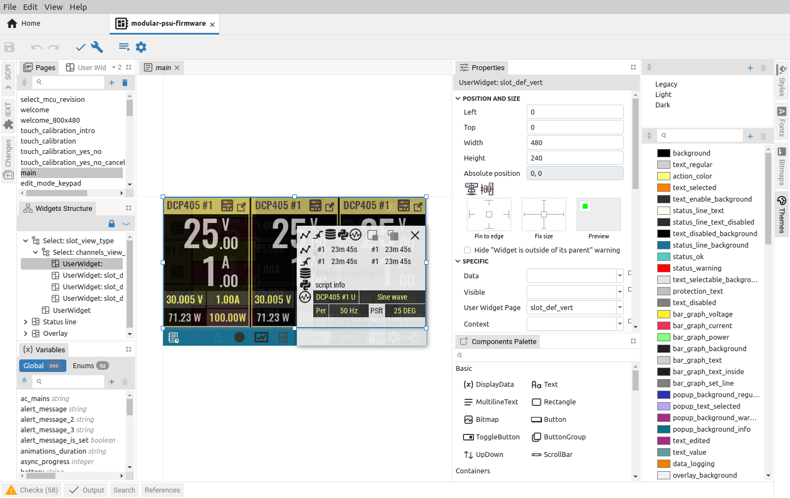
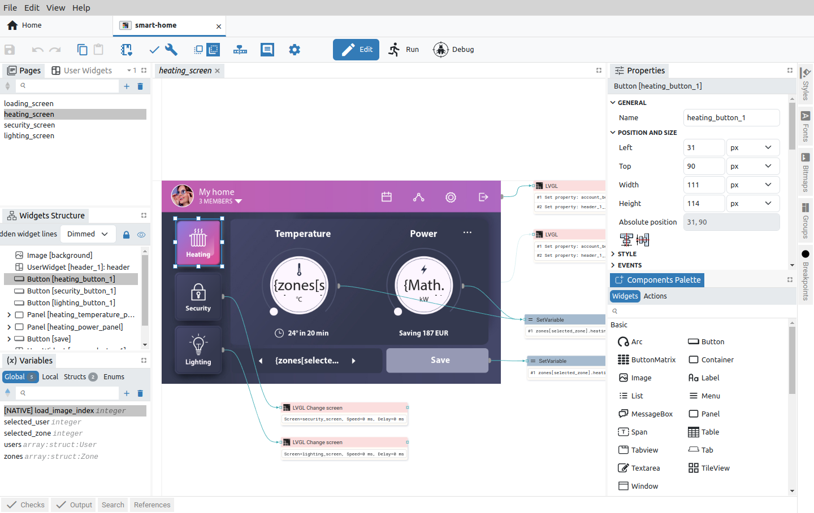

[](https://github.com/eez-open/studio/releases) [](https://github.com/eez-open/studio/blob/master/LICENSE.TXT) [](https://liberapay.com/eez-open/donate) [](https://github.com/eez-open/studio/releases)

### Ownership and License

The contributors are listed in CONTRIB.TXT. This project uses the GPL v3 license, see LICENSE.TXT.
EEZ Studio uses the [C4.1 (Collective Code Construction Contract)](http://rfc.zeromq.org/spec:22) process for contributions.
To report an issue, use the [EEZ Studio issue tracker](https://github.com/eez-open/studio/issues).

_Important note: Envox d.o.o. does not claim any ownership rights to the source code generated by the `Build` command except in the case of a project that uses EEZ Flow when it is given under the MIT license._  
_The user owns the `.eez-project` file and all the source code generated from the file template definitions that are part of `eez-project` file. EEZ Studio may also generate files that are under MIT, BSD 2.0 or Public Domain license._

### Links

-   [Web page](https://www.envox.eu/studio/studio-introduction/)
-   [FAQ](https://github.com/eez-open/studio/wiki/Q&A)
-   [Discord](https://discord.gg/q5KAeeenNG) server
-   [X (Twitter)](https://twitter.com/envox)
-   [Mastodon](https://mastodon.social/@envox)
-   [YouTube](https://www.youtube.com/c/eezopen) channel
-   [Liberapay](https://liberapay.com/eez-open/donate) donations 

## Introduction

EEZ Studio is a free and open source cross-platform low-code visual tool for desktop and embedded GUIs with [LVGL](https://lvgl.io/) support. Built-in _EEZ Flow_ enables the creation of complex scenarios for test and measurement automation, and the Instruments feature offers remote control of multiple devices and T&M equipment including [EEZ BB3](https://github.com/eez-open/modular-psu) T&M chassis and [EEZ H24005](https://github.com/eez-open/psu-hw) programmable power supply and any other T&M devices that support [SCPI](https://www.ivifoundation.org/scpi/) from manufacturers such as Keysight, Rigol, Siglent, etc.

### EEZ Studio _Project_



-   Modular visual development environment for designing TFT display screen decorations and defining user interaction (embedded GUI)
-   Generate C++ code for embedded GUI functionality that can be directly included in [STM32CubeIDE](https://www.st.com/en/development-tools/stm32cubeide.html) for BB3 and other STM32 target platforms or [Arduino IDE](https://www.arduino.cc/en/software) for H24005 and other Arduino compatible target platforms
-   _Instrument definition file_ (IDF) builder with context sensitive SCPI commands help (based on Keysight’s [Offline Command Expert command set](https://www.keysight.com/main/software.jspx?cc=US&lc=eng&ckey=2333687&nid=-11143.0.00&id=2333687) XML structure) suitable for EEZ Studio _Instrument_ and [Keysight Command Expert](https://www.keysight.com/en/pd-2036130/command-expert)
-   SCPI command help generator based on bookmarked HTML generated directly from .odt file using [EEZ WebPublish](https://github.com/eez-open/WebPublish) extension for OpenOffice/LibreOffice.
-   [LVGL](https://lvgl.io/) (Light and Versatile Graphics Library) 8.x and 9.x support
-   Project templates (using giteo.io repositories) and comparison of projects
-   Drag&drop editor for creating instrument's desktop dashboard (for remote control and management)
-   Flowchart based low-code programming for desktop dashboard



### EEZ Studio _Instrument_


-   Dynamic environment where multiple instruments can be configured and easily accessed
-   Session oriented interaction with each SCPI instrument
-   Serial (via USB), Ethernet and VISA (via free [R&S®VISA](https://www.rohde-schwarz.com/us/driver-pages/remote-control/3-visa-and-tools_231388.html)) T&M instrument interfaces support
-   Direct import of EEZ Studio generated IDFs and **Keysight’s Offline Command Expert command** sets
-   IEXT (Instrument EXTension) catalog with growing number of supported instruments (Rigol, Siglent, Keysight, etc.)
-   History of all activities with search/content filtering
-   Quick navigation via calendar ("heatmap") or sessions list view
-   Shortcuts (hotkeys and buttons) that can be user defined or come predefined from imported IDF. The shortcut can contain single or sequence of SCPI commands or Javascript code.
-   Javascript code for task automation (e.g. logfile, or programming list upload/download, etc.) can be also assigned to the shortcut
-   SCPI commands context sensitive help with search
-   File upload (instrument to PC) with image preview (e.g. screenshots)
-   File download (PC to instrument) automation for transferring instrument profiles
-   Simple arbitrary waveform editor (envelope and table mode)
-   Displaying measurement data as graphs
-   FFT analysis, harmonics and simple math functions (Period, Frequency, Min, Max, Peak-to-Peak, Average)
-   Export graphs as .CSV file

---

New functionality is under development thanks to the sponsorship of the [NGI0 PET](https://nlnet.nl/project/EEZ-DIB/) and [NGI0 Entrust](https://nlnet.nl/project/EEZ-Studio/#ack) funds from NLnet. The following milestones have been achieved so far:

-   [M1](https://github.com/eez-open/studio/issues/102) - Visual editor
-   [M2](https://github.com/eez-open/studio/issues/103) - Interpreter for PC
-   [M3](https://github.com/eez-open/studio/issues/104) - Interpreter for BB3
-   [M4](https://github.com/eez-open/studio/issues/134) - Debugger for PC
-   [M5](https://github.com/eez-open/studio/issues/135) - Debugger for BB3
-   [M6](https://github.com/eez-open/studio/releases/tag/0.9.90) - EEZ flow engine unification
-   [M7](https://github.com/eez-open/studio/releases/tag/v0.9.91) - Multilanguage support in project
-   [M8](https://github.com/eez-open/studio/releases/tag/v0.9.92) - Widgets advanced control
-   [M9](https://github.com/eez-open/studio/releases/tag/v0.9.93) - Project templates
-   [M10](https://github.com/eez-open/studio/releases/tag/v0.9.94) - Gitea.io integration
-   [M11](https://github.com/eez-open/studio/releases/tag/v0.9.95) - New EEZ Flow extensions
-   [M12](https://github.com/eez-open/studio/releases/tag/v0.9.96) - LVGL integration
-   [M13](https://github.com/eez-open/studio/releases/tag/v0.9.98) - Standalone Flow dashboard
-   [M14](https://github.com/eez-open/studio/releases/tag/v0.9.99) - Home page modifications and enhancements
-   [M15](https://github.com/eez-open/studio/releases/tag/v0.10.1) - Enhancements (more examples, extension manager, MQTT)
-   [M16](https://github.com/eez-open/studio/releases/tag/v0.10.2) - Online help, enhancements, bug fixing for “Actions”
-   [M17](https://github.com/eez-open/studio/releases/tag/v0.10.3) - Online help, enhancements, bug fixing for “Widgets”
-   [M18](https://github.com/eez-open/studio/releases/tag/v0.12.0) - Simultaneous control of multiple instruments
-   [M19](https://github.com/eez-open/studio/releases/tag/v0.13.0) - Support for non-SCPI instruments and devices
-   [M20](https://github.com/eez-open/studio/releases/tag/v0.14.0) - Hybrid table/tree/grid widget
-   [M21](https://github.com/eez-open/studio/releases/tag/v0.15.0) - Project scrapbook
-   [M22](https://github.com/eez-open/studio/releases/tag/v0.16.0) - Improvement of session-centric work with instruments and data management
-   [M23](https://github.com/eez-open/studio/releases/tag/v0.17.0) - Multimedia support / Support for networking / other Instruments related
---

## Installation

64-bit OS is required in all cases.

### Linux

Depending on your linux distribution, choose one of the listed packages (.deb, .rpm) and start the installation using the associated installer.
In addition, there is a self-executing .AppImage version that, after downloading, needs to enable the `Allow executing file as program` under file `Permissions` before starting it.
If you encounter a problem running the .AppImage version on your Linux distribution, try running it using the `--no-sandbox` option, i.e. `./EEZ-Studio-[version].AppImage --no-sandbox`

### Mac

Download `eezstudio-mac.zip`, unpack and move `eezstudio.app` to Applications.

### Windows

Download and start `EEZ_Studio_setup.exe`.

### Nix

The Nix flake provides a derivation for EEZ Studio or an overlay
that provides that derivation. It can be used to install the project using
[Nix package manager](https://nixos.org/).

### Build and run from source (all operating systems)

-   Install `Node.JS 16.x` or newer
-   Install `node-gyp`, more information at https://github.com/nodejs/node-gyp#installation

#### Only Linux:

```
sudo apt-get install build-essential libudev-dev libnss3
```

#### Only Raspbian:

Install Node.js 16 and npm on Raspberry Pi: https://lindevs.com/install-node-js-and-npm-on-raspberry-pi/

```
sudo apt-get install build-essential libudev-dev libopenjp2-tools ruby-full
sudo gem install fpm
```

#### All platforms:

```
git clone https://github.com/eez-open/studio
cd studio
npm install
npm run build
```

Start with:

```
npm start
```

Create distribution packages (except MacOS and Raspbian):

```
npm run dist
```

On MacOS:

```
npm run dist-mac-arm64
```

or

```
npm run dist-mac-x64
```

On Raspbian:

```
npm run dist-raspbian
```

#### Nix

To build:

```
nix build 'github:eez-open/studio'
```

To start:

```
nix run 'github:eez-open/studio'
```

## USB TMC

The USB TMC driver must be installed if you want to access the T&M instrument using the USB-TMC interface from EEZ Studio _Instrument_ section.

### Windows

Download and start [Zadig](http://zadig.akeo.ie/). Select your device, select libusb-win32 and press "Replace Driver" button:


### Linux

You will probably need to add your Linux account to the usbtmc group before you can access the instrument using EEZ Studio. Connect your instrument with a USB cable and turn it on. Wait until booting is complete. Now check the instrument group name by entering the following command:

```
ls -l /dev/usbtmc*
```

In case it is root, enter the command:

```
sudo groupadd usbtmc
```

Now, add your account (<username>) to the group:

```
sudo usermod -a -G usbtmc <username>
```

A reboot is required. After that, the gid of `/dev/usbtmc0` should be set to `usbtmc` and
you are ready to use your instrument via USB-TMC interface.

## FAQ

[FAQ Wiki](https://github.com/eez-open/studio/wiki/FAQ)

**Q**: Where is the database file by default?
**A**: Depending on the operating system, it can be:

-   Linux: `~/.config/eezstudio/storage.db`
-   Mac: `~/Library/Application\ Support/eezstudio/storage.db`
-   Windows: `%appdata%\eezstudio\storage.db`

The default created database as well as its location can be changed later through the options in the _Settings_ section of EEZ Studio.

**Q**: Where are the IEXTs (Instrument EXTensions) used to access T&M instruments stored?
**A**: Depending on the operating system, it can be:

-   Linux: `~/.config/eezstudio/extensions`
-   Mac: `~/Library/Application\ Support/eezstudio/extensions`
-   Windows: `%appdata%\eezstudio\extensions`
