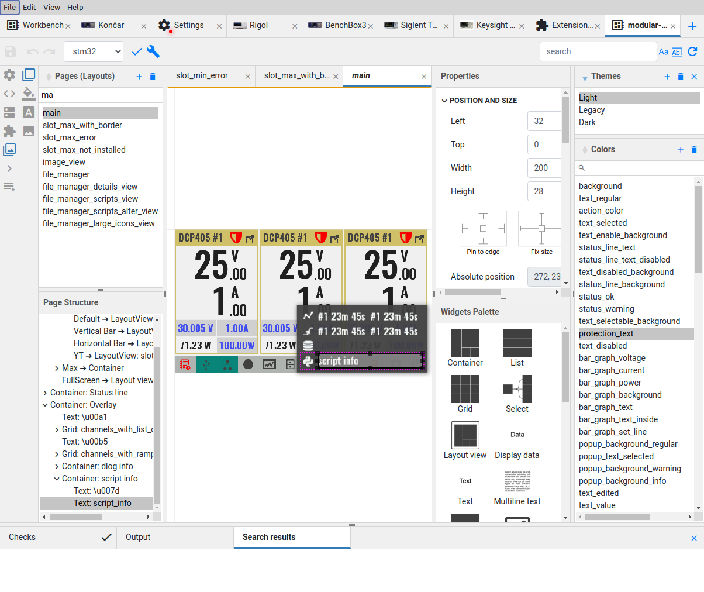
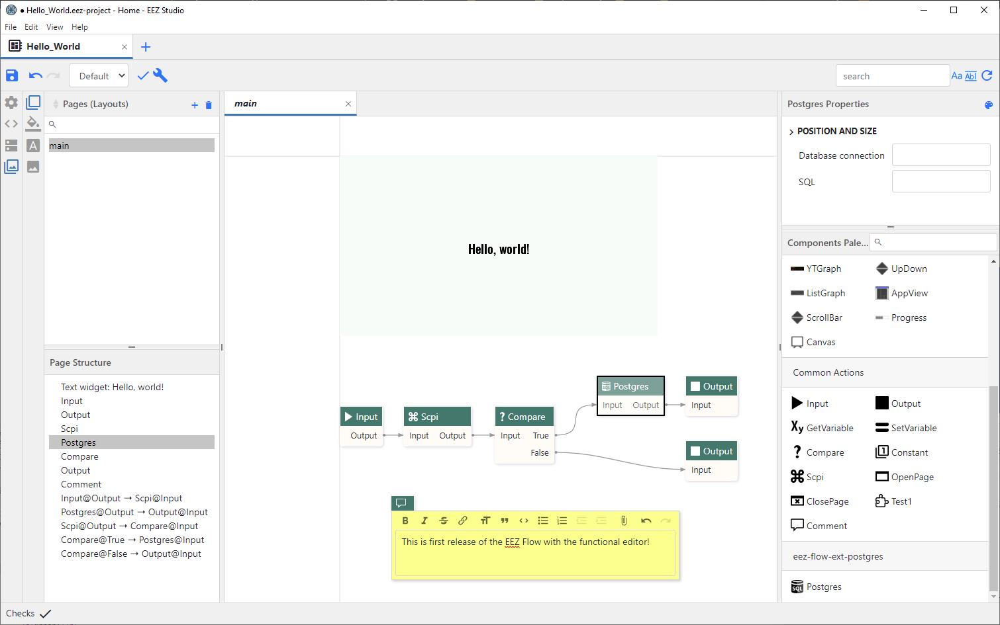
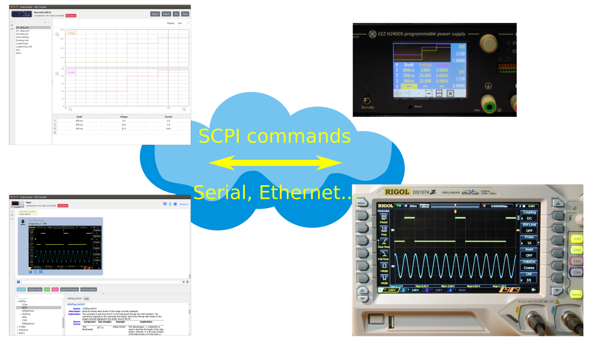

[](https://github.com/eez-open/studio/releases) [](https://github.com/eez-open/studio/blob/master/LICENSE.TXT) [](https://liberapay.com/eez-open/donate)

### Ownership and License

The contributors are listed in CONTRIB.TXT. This project uses the GPL v3 license, see LICENSE.TXT.
EEZ Studio uses the [C4.1 (Collective Code Construction Contract)](http://rfc.zeromq.org/spec:22) process for contributions.
To report an issue, use the [EEZ Studio issue tracker](https://github.com/eez-open/studio/issues).

## Introduction

The EEZ Studio is an open source cross-platform modular visual tool aimed to address various programming and management tasks for [EEZ BB3](https://github.com/eez-open/modular-psu) open source T&M chassis and [EEZ H24005](https://github.com/eez-open/psu-hw) programmable power supply and other T&M devices that support SCPI from manufacturers such as Keysight, Rigol, Siglent, etc.

### EEZ _Flow_ (ex. Studio Project Editor or ESP)



-   Modular visual development environment for designing TFT display screen decorations and defining user interaction (HMI)
-   Supported modules (project features):
    -   _Settings (General, Build, Configurations, Files)_
    -   _Actions_
    -   _Data_
    -   _Extension definitions_
    -   _GUI (Pages, Widgets, Styles, Fonts, Bitmaps)_
    -   _SCPI (command subsystems, commands and context sensitive help)_
    -   _Shortcuts_
-   Generate C++ code for HMI functionality that can be directly included in STM32CubeIDE for BB3 or Arduino IDE for H24005
-   _Instrument definition file_ (IDF) builder with context sensitive SCPI commands help (based on Keysight’s [Offline Command Expert command set](https://www.keysight.com/main/software.jspx?cc=US&lc=eng&ckey=2333687&nid=-11143.0.00&id=2333687) XML structure) suitable for EEZ Studio Workbench (ESW) and [Keysight Command Expert](https://www.keysight.com/en/pd-2036130/command-expert)
-   SCPI command help generator based on bookmarked HTML generated directly from .odt file using [EEZ WebPublish](https://github.com/eez-open/WebPublish) extension for OpenOffice/LibreOffice.



New functionality is under development thanks to the sponsorship of the [NGI0 PET](https://nlnet.nl/project/EEZ-DIB/) fund from NLnet, which will enable quick and easy creation of flow diagrams using ready-made components. The target for executing the flow chart can be PC or EEZ BB3. This will be realized in five milestones:
* [M1](https://github.com/eez-open/studio/issues/102) - Visual editor
* [M2](https://github.com/eez-open/studio/issues/103) - Interpreter for PC
* [M3](https://github.com/eez-open/studio/issues/104) - Interpreter for BB3
* [M4](https://github.com/eez-open/studio/issues/134) - Debugger for PC
* [M5](https://github.com/eez-open/studio/issues/135) - Debugger for BB3

Interpreting the flowchart on a PC will allow the creation of a dashboard for remote control of various T&M instruments (including EEZ BB3). The debugger will simplify and speed up the development of flowcharts as it will allow step-by-step execution, setting breakpoints, etc.
Adding a flow chart interpretation on EEZ BB3 will open up entirely new possibilities for quickly creating different test scenarios, automating measurement data collection, and more.

### EEZ Studio Workbench (ESW)



-   Dynamic environment where multiple instruments and other "widgets" can be placed and easily accessed
-   **Session oriented interaction with each SCPI instrument**
-   Support for serial (via USB) and TCP/IP communication
-   Direct import of ESP generated IDFs and **Keysight’s Offline Command Expert command** sets
-   IEXT (Instrument EXTension) catalog with growing number of supported instruments (Rigol, Siglent, Keysight, etc.)
-   History of all activities with search/content filtering
-   Quick navigation via calendar ("heatmap") or sessions list view
-   Shortcuts (hotkeys and buttons) that can be user defined or come predefined from imported IDF. The shortcut can contain single or sequence of SCPI commands or Javascript code.
-   Javascript code for task automation (e.g. logfile, or programming list upload/download, etc.) can be also assigned to the shortcut
-   SCPI commands context sensitive help with search
-   File upload (instrument to PC) with image preview (e.g. screenshots)
-   File download (PC to instrument) automation for transferring instrument profiles
-   Simple arbitrary waveform editor (envelope and table mode)
-   Displaying measurement data as graphs
-   FFT analysis, harmonics and simple math functions (Period, Frequency, Min, Max, Peak-to-Peak, Average)
-   Export graphs as .CSV file

---

**Scheduled for future releases:**

-   Support for other connections (i.e. VXI-11, USBTMC, IVI) using 3rd party open source
-   Instrument extensions for popular instruments from other vendors
-   Print and PDF export
-   (External) Data logger functionality
-   Protocol analyzer using 3rd party open source
-   Import/export of all working data (i.e. measurements, session history, shortcuts, settings, etc.) for archiving purposes or easier integration with e.g. [ELN](https://en.wikipedia.org/wiki/Electronic_lab_notebook)s

## Installation

64-bit OS is required in all cases.

### Linux

Download `eezstudio-linux-x64.tar.gz`, unpack and select `eezstudio`.

### Mac

Download `eezstudio-mac.zip`, unpack and move `eezstudio.app` to Applications.

### Windows

Download and start `EEZ_Studio_setup.exe`.

### Nix
There is a Nix flake that provides a derivation for EEZ Studio or an overlay
that provides that derivation. They can be used to install the project using
[Nix package manager](https://nixos.org/).

### Build and run from source (all operating systems)

-   Install `Node.JS 8.9.x` or newer
-   Install `node-gyp`, more information at https://github.com/nodejs/node-gyp#installation

#### Only Linux:

```
sudo apt-get install build-essential libudev-dev
```

#### All platforms:

```
git clone https://github.com/eez-open/studio
cd studio
npm install
npm run build
```

Start with:

```
npm start
```

Create distribution packages:

```
npm run dist
```

#### Nix
To build:
```
nix build 'github:eez-open/studio'
```

To start:
```
nix run 'github:eez-open/studio'
```

## USB TMC

### Windows

Download and start [Zadig](http://zadig.akeo.ie/). Select your device and click "Install WCID Driver" button.

### Linux

Follow instructions described [here](https://www.teuniz.net/DSRemote/) under "USB connection".

## FAQ

### Where is database file located?

-   Linux: `~/.config/eezstudio/storage.db`
-   Mac: `~/Library/Application\ Support/eezstudio/storage.db`
-   Windows: `%appdata%\eezstudio\storage.db`

Creating database someplace else can be done from ESW Settings.

### Where are installed extensions stored?

-   Linux: `~/.config/eezstudio/extensions`
-   Mac: `~/Library/Application\ Support/eezstudio/extensions`
-   Windows: `%appdata%\eezstudio\extensions`
