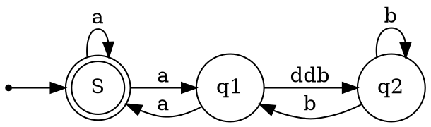

Shared component: [chart.tsx](../src/shared/ui/chart.tsx)

Used in:

-   Waveform

    -   [Generic](../src/instrument/window/waveform/generic.tsx)
    -   [DLog](../src/instrument/window/waveform/generic.tsx)
    -   [Multi](../src/instrument/window/waveform/generic.tsx)

-   Lists

    -   [Envelope](../src/instrument/window/lists/envelope.tsx)
    -   [Table](../src/instrument/window/lists/table.tsx)

