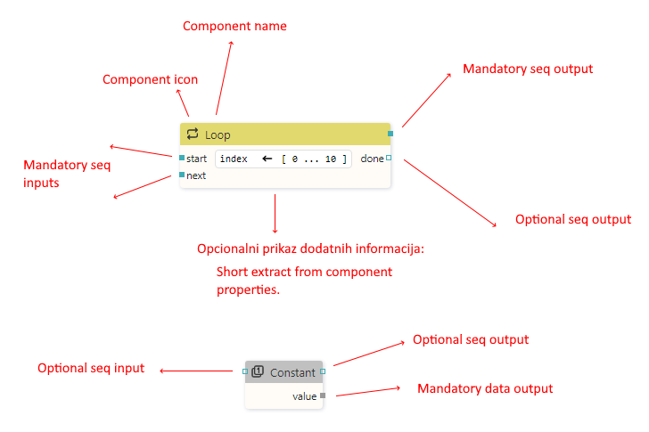
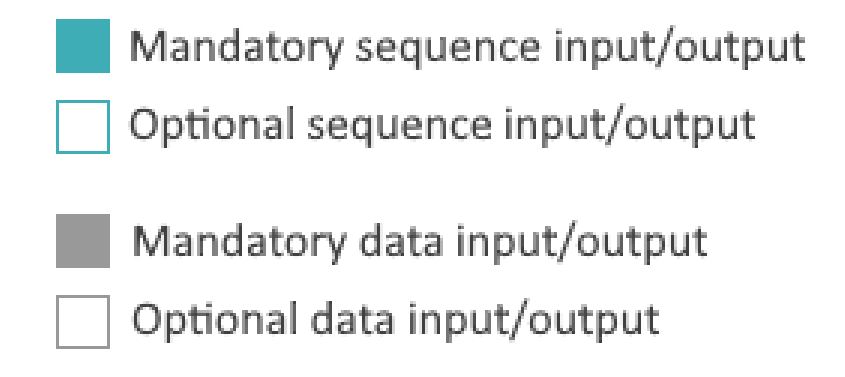

# Actions panel

Ovo treba opisati slično kao i Pages panel

# Action editor

-   Ovdje se radi sa action componentama i dosta toga je slično kao u Page editoru samo što se radi sa action componentama a ne sa widgetima: znači kako se dodaju action componente (drag and drop iz palete), selekcija action componenti, uređivanje preko properties panela, itd se može preuzeti iz opisa page editora.

-   Ono što je tu novo je spajanje action componenti sa linijama

    -   Spajanje inputa na neki output: mouse click na input i povlaćenje linije do outputa dok linija ne pozeleni.
    -   Moguće je i spajanje na isti način od outputa prema inputu.
    -   Moguće je prebacivanje svih linija koje završavaju u jednom outputu na neki drugi output: ovdje treba koristiti SHIFT tipku. Moguće je i prebaciti samo neke linije koje smo prije toga selektirali (koristi se CTRL za select/deselect linije).

-   Komponenta se sastoji od:

    -   Ikone
    -   Naziva
    -   Inputa
    -   Outputa
    -   Opcionalno dodatnih informacija

Trebati će napraviti bolji screenshot od ovoga.

-   Postoje sequence (označen plavom bojom) i data input/output (označen sivom bojom)

-   Svaki input/output je optional ili mandatory

-   Mandatory input/output je označen popunjenim kvadratom

-   Kroz data input se prima konkretan podatak: integer, string, structure, itd. A kroz sequence input se prima samo tkz. null data - tj. samo informacija da je došao podatak, a sama vrijednost nije bitna.
