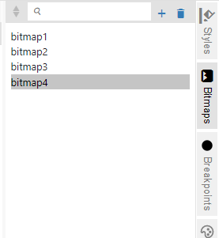
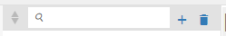
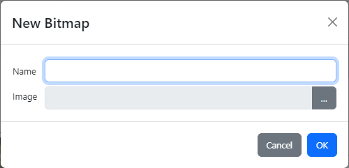
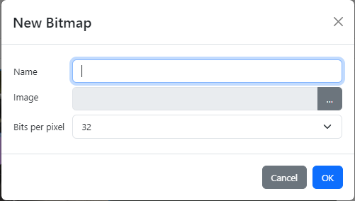
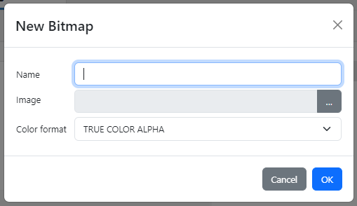
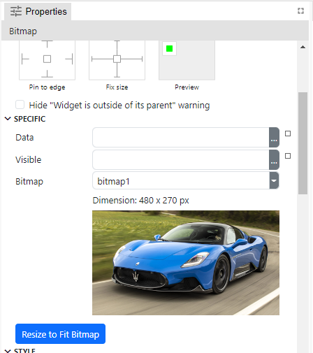
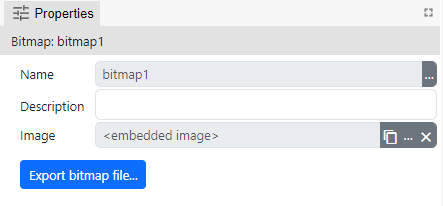

-   Kolekcija bitmapa koje se koriste u projektu.



-   Toolbar



-   Dodavanje bitmape:







-   Bitmapa se može koristiti u stilu ili u Bitmap widgetu (Dashboard i EEZ-GUI projekt), tj. Image widgetu (LVGL projekt)

-   Primjer korištenja bitmape u Bitmap widgetu u Dashboard projektu:



-   Bitmap properties:



    -   Name: Naziv bitmape po kojem se bitmapa referencira u ostatku projekta
    -   Description: Neobavezni opis bitmape
    -   Image: Ovo je sami image file koji se sprema unutar projekt fajla (embedded within project file). Postoji button Export Bitmap File s kojim se može eksportati embeddani image.

Posebno za EEZ-GUI projekt imamo ove dodatne propertije:

-   Id
    -   ovo sam već prije objasnio ćemu služi
-   Bits per pixel:
    -   32: RGBA
    -   16: RGB565
-   Style:
    -   Ovo imamo samo ako je za "Bits per pixel" odabrano 16.
    -   Koristi se samo background color iz čitavo stila
    -   Ako postoji neki transparentni pixel u zadanoj bitmapi onda će biti prikazan background color

A za LVGL projekt imamo ovaj dodatni properti:

-   Color format: https://docs.lvgl.io/8.3/overview/image.html#color-formats

```
LV_IMG_CF_ALPHA_1_BIT              "ALPHA 1 BIT"
LV_IMG_CF_ALPHA_2_BIT              "ALPHA 2 BIT"
LV_IMG_CF_ALPHA_4_BIT              "ALPHA 4 BIT"
LV_IMG_CF_ALPHA_8_BIT              "ALPHA 8 BIT"

LV_IMG_CF_INDEXED_1_BIT            "INDEXED 1 BIT"
LV_IMG_CF_INDEXED_2_BIT            "INDEXED 2 BIT"
LV_IMG_CF_INDEXED_4_BIT            "INDEXED 4 BIT"
LV_IMG_CF_INDEXED_8_BIT            "INDEXED 8 BIT"

LV_IMG_CF_RAW                      "RAW"
LV_IMG_CF_RAW_CHROMA               "RAW CHROMA"
LV_IMG_CF_RAW_ALPHA                "RAW ALPHA"

LV_IMG_CF_TRUE_COLOR               "TRUE COLOR"
LV_IMG_CF_TRUE_COLOR_ALPHA         "TRUE COLOR ALPHA"
LV_IMG_CF_TRUE_COLOR_CHROMA_KEYED  "TRUE COLOR CHROMA"

LV_IMG_CF_RGB565A8                 "RGB565A8"
```
