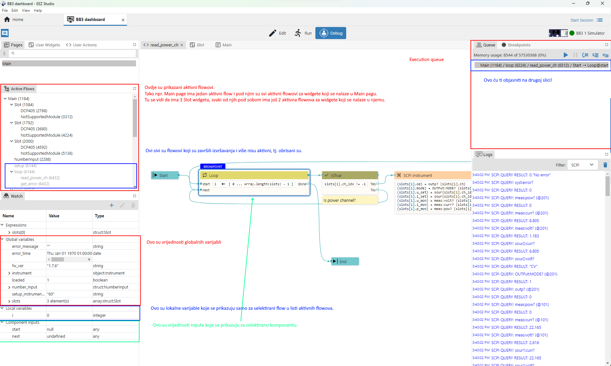
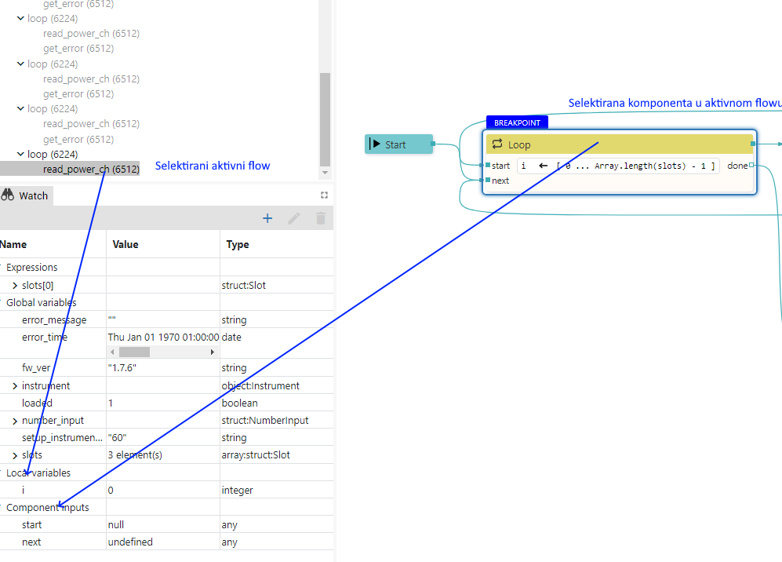
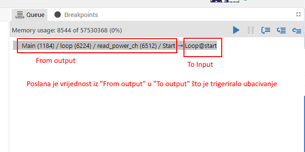
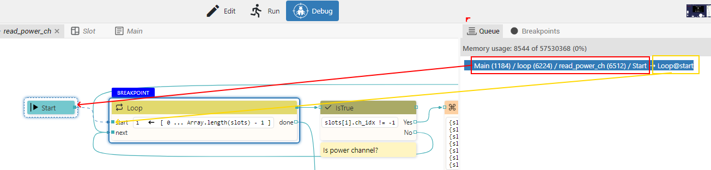
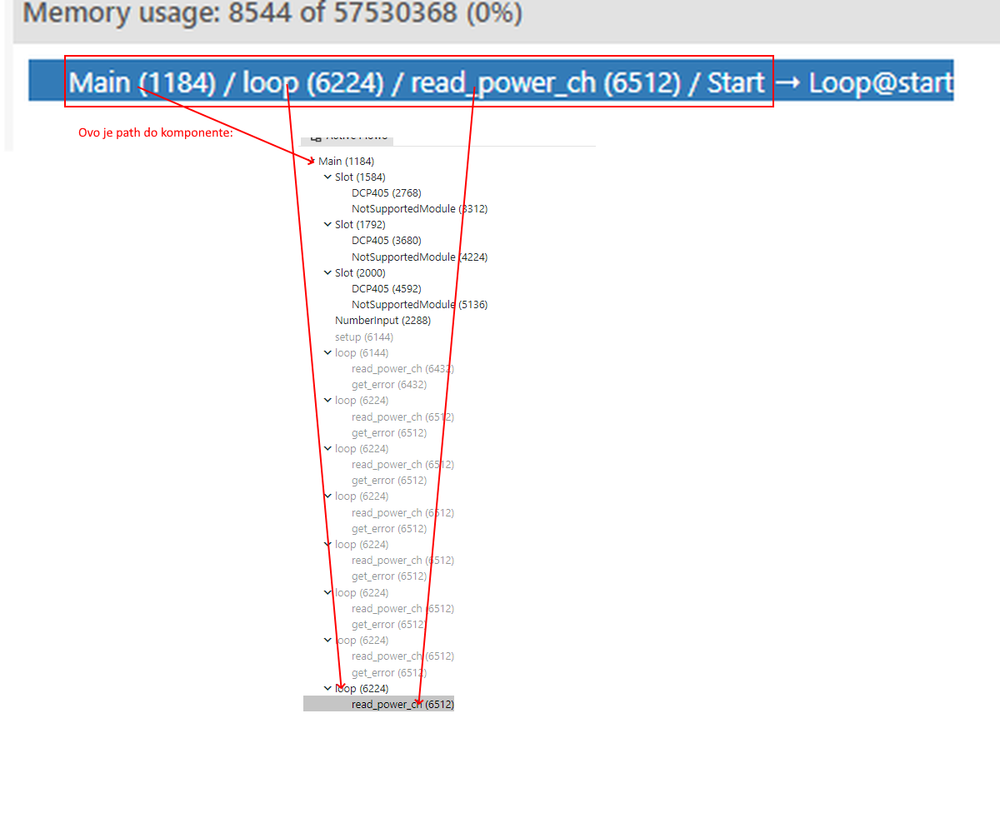
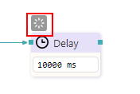
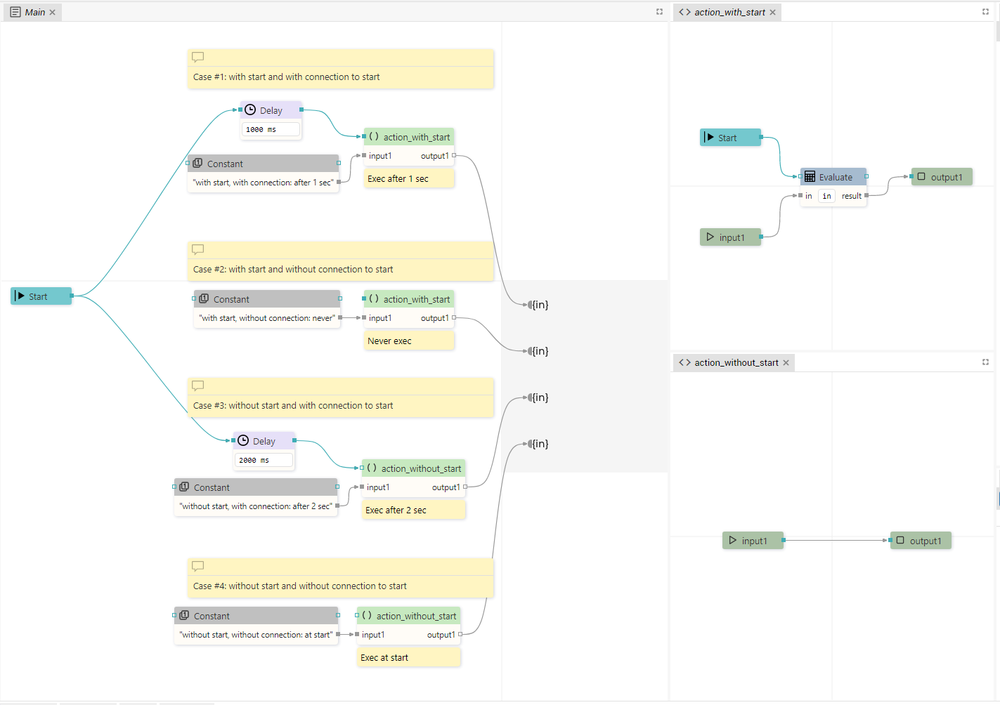

# Flow execution

-   Tijekom izvršavanja čuva se trenutna vrijednost svih globalnih varijabli i lista aktivnih flowova.

-   U nekom trenutku postoji jedan ili više aktivnih flowova. Svaki aktivni flow čuva trenutnu vrijednosti svih svojih lokalnih varijabli, vrijednosti svih inputa na svim komponentama i interno stanje svih komponenti koje pripadaju tom flowu (naime, neke komponente imaju interno stanje, npr. Loop komponenta pamti do kuda je stigla).

-   Execution queue sadrži listu svih komponenti koje su spremne za izvršavanje. Svi aktivni flowovi dijele isti execution queue.

-   Ovdje ubaciti Sliku koja prikazuje trenutno stanje izvršavanja flowa:

    -   Global variable values
    -   List of active flows
        -   For each active flow:
            -   Local variable values
            -   Component input values
            -   Component internal states
    -   Execution queue

Slika koja opisuje kako se u debug modu vizualizira stanje flow engina:

Slika koja opisuje kako se prikazuje lokalne varijable za selektirani aktivni flow i component inputu za selektiranu komponentu:

Slike koja opisuju jedan item u execution queue:

Slika koja opisuje component path. Brojevi u zagradama su memorijske adrese gdje se čuva stanje pojedinog aktivnog flowa.

-   Jedna po jedna komponenta se uzima sa početka execution queuea i izvršava se.

-   Tijekom izvršavanja neke komponente može se poslati podatak na neki od outputa koji će se onda proslijediti preko konekcijskih linije na inpute drugih komponenata.

-   U trenutku kada komponenta primi podatak preko konekcijske linije na nekom od inputa ona će biti stavljena na kraj execution queue (tj. spremna je na izvršavanje kada dođe na red) ako je do tada primila podatak na svim data inputima i na baram jednom sequence inputu (ako takav postoji). Ako ne postoji niti jedna linija koja završava u nekom inputu onda se taj input ne gleda u ovom testu. Zašto samo jedan sequence input? Pa npr. Loop komponenta ima dva sequence inputa Start i Next i dovoljno je da na jednom dođe podatak da postane spremna za izvršavanje (jednom na Start i kasnije više puta na Next).

-   Prilikom izvršavanja komponente svi sequence inputi se brišu (data value is cleared), a data inputi čuvaju trenutni podatak (last data value is kept). Što znači da ako kasnije dođe novi podatak samo na jednom sequence inputu, komponenta će opet biti izvršena jer već ima podatke na svim data inputima pošto se oni čuvaju. S tim da su ovdje mogući izuzeci kada neka komponenta može sama obrisati vrijednost na nekom od svojih data inputa. Za takve komponente to će biti posebno navedeno u njenom opisu.

-   Ako komponenta nema inpute (ili ako ne postoji niti jedna linija koja završava u nekom od inputa komponente) onda se ona odmah u tijeku inicijalizacije (tj. kod pokretanja flowa) stavlja u execution queue. Npr. Start je takva komponenta i ona se uvijek odmah izvršava.

-   Catch error komponenta, iako nema inpute, neće se odmah izvršiti nego samo kada se desi greška u flowu u kojem se ona nalazi

-   OnEvent komponenta, iako nema inpute, neće se odmah izvršiti nego samo kada se desi page event (primjeri page eventa: open page, close page).

-   Widgeti se odmah izvrše. Naime, widgeti su također komponente koje sudjeluju u izvršavanu flowa: mogu dobiti vrijednosti na svojim inputima i mogu slati vrijednosti preko svojih outputa.

-   Komponente koje čuvaju interno stanje, tj. čije izvršavanje traje neko duže vrijeme, u debuggeru su označene sa posebnom ikonom. Primjer takvih komponenti: Loop, Delay, SCPI, itd. Takve komponente kada odrade dio svog posla mogu same sebe ponovno staviti u queue. Npr. SCPI komponenta izvrši prvu komandu, stavi se ponovno u queue, pa izvrši drugu komandu, stavi se u queue i tako do zadnje komande - pri tom čuva informaciju u svom internom stanju do koje komande je stigla. Na ovaj način je postignuto paralelno izvršavanje svih flowova, tj. ne čeka se na SCPI komponentu da izvrši sve svoje komande prije nego što se neka druga komponenta može izvršiti.

-   User akcije mogu imati mandatory/optional sequence input, samo mandatory inpute i optional outpute:

Ovo su slike koje opisuju neke situacije koje možemo imati kod user akcija:

Budući u case #2 imamo mandatory sequence input a ništa nije spojeno na njega, akcija se neće izvršiti i biti će prikazana greška u editoru. Važna napomena: Iako postoji greška u editoru, dopušteno je pokrenuti takav flow. To je zgodno za slučaj da nisi sve spojio, ali ipak želiš testirati to što si napravi do sada.
