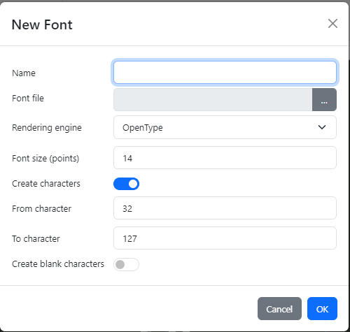
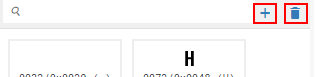
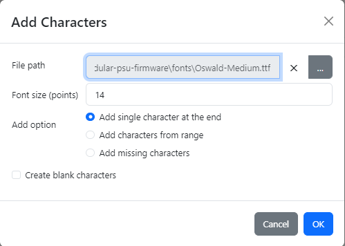
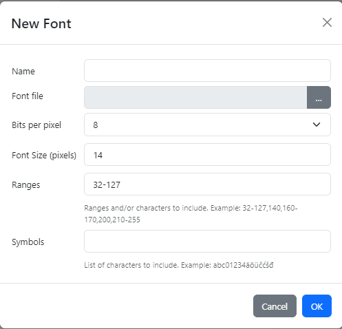
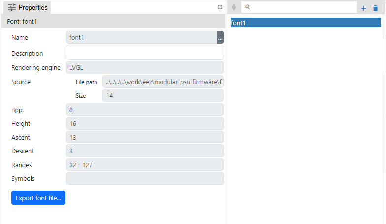
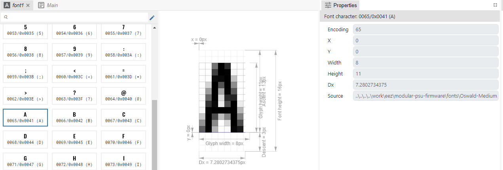
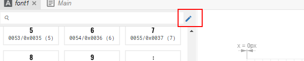
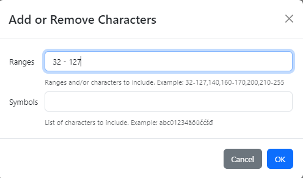

-   Kolekcija fontova koji se koriste u projektu.

-   Font se sastoji od jednog ili više karaktera koji se uzimaju iz TTF ili OTF fajla i pretvaraju u antialiasing bitmape.

-   Fontovi se definiraju samo za EEZ-GUI i LVGL projekte, a Dashboard projekti ne koriste fontove. Tj. u Dashboard projektu se koriste vektorski fontovi a font se bira prema nazivu (Font Family property u Stilu).

-   U EEZ-GUI projektu imamo više mogućnosti za uređivanje fontova nego u LVGL projektu, pa ćemo rad sa fontovima u ta dva projekta opisati u zasebnim poglavljima.

# EEZ-GUI projekt

Dodavanje novog fonta:

-   Rendering engine, koji može biti FreeType (https://freetype.org/) ili OpenType (https://opentype.js.org/), vrši samu konverziju iz vektorskog zapisa fonta u bitmapni zapis.

-   Size je u pointima. Ovo je formula za pretvorbu pointa u pixele: 1 pt = 1.333 px

-   Ako je Create characters unchecked neće se kreirati niti jedan karakter, tj. karakteri se mogu naknadno dodavati. Ako je checked onda se odabire range karaktera koji se kreiraju, s tim da se sa Create blank characters može odabrati da su svi karakteri prazni. Ove se opcije rijetko koriste, a mogu poslužiti za kreiranje icon fontova.

-   Kada se font kreira mogu se pregledavati kreirani karatkeri:

-   Nakon što se font kreira možemo dodavati još karaktera ili brisati pojedinačne karaktere:

-   Za Dodavanje karaktera imamo 3 opcije:

3 opcija (add missing characters) je prisutna samo ako se koristi multilanguage (Texts panel) i postoji karakter u nekom od stringova koji nije prisutan u fontu.

-   Postoji i uređivanje karaktera koji je selektiran, ali za sada se može samo paliti i gasiti pojedinačni pixeli. Ono što nam fali je paleta nijansi sive tako da možemo postaviti nijansu sive pojedinačnog pixela

-   Također se može bitmapa selektiranog karaktera kopirati na clipboard sa Ctrl+C ili uzeti sa clipboarda sa Ctrl+V

# LVGL

-   Koristi se ovaj library: https://github.com/lvgl/lv_font_conv

-   Kreiranje novog fonta

-   Ovdje je Font Size u pixelima

-   Font properties (sve je readonly osim description):

-   Character properties je isto sve readonly

-   Nakon što se font kreira jedino što možemo raditi s fontom u smislu uređivanje je dodavati ili brisati charactere iz fonta s ovom ikonom:

koja otvara ovaj dialog:

