<!-- TOC -->

-   [M14 Projects section in Home tab](#m14-projects-section-in-home-tab)
-   [M14 Kreiranje novog projekta](#m14-kreiranje-novog-projekta)
-   [M14 Overview of ProjectEditor GUI](#m14-overview-of-projecteditor-gui)
    -   [M14 Project editor modes](#m14-project-editor-modes)
    -   [M14 Toolbar](#m14-toolbar)
        -   [M14 Toolbar in edit mode](#m14-toolbar-in-edit-mode)
        -   [M14 Toolbar in Debug Mode](#m14-toolbar-in-debug-mode)
        -   [M14 Mode switcher](#m14-mode-switcher)
        -   [M14 Global variables status](#m14-global-variables-status)
    -   [M14 Panels](#m14-panels)
    -   [M14 Editors](#m14-editors)
    -   [M14 Viewers](#m14-viewers)
-   [M14 Editiranje projekta](#m14-editiranje-projekta)
    -   [M14 Settings](#m14-settings)
    -   [M14 Pages](#m14-pages)
    -   [M14 Actions](#m14-actions)
    -   [M14 Variables](#m14-variables)
    -   [M15 Styles](#m15-styles)
    -   [M15 Fonts](#m15-fonts)
    -   [M15 Bitmaps](#m15-bitmaps)
    -   [Animation timeline editor](#animation-timeline-editor)
    -   [Optional features](#optional-features)
        -   [Texts](#texts)
        -   [SCPI](#scpi)
        -   [IEXT](#iext)
        -   [Shortcuts](#shortcuts)
        -   [Changes](#changes)
        -   [MicroPython](#micropython)
        -   [M15 Readme](#m15-readme)
    -   [Check](#check)
    -   [Search & Replace](#search--replace)
-   [M14 Prinicipi rada Flow-a](#m14-prinicipi-rada-flow-a)
-   [Projekti bez Flow-a](#projekti-bez-flow-a)
-   [Build](#build)
-   [Izvršavanje projekta](#izvr%C5%A1avanje-projekta)
    -   [Run mode](#run-mode)
    -   [Debugging mode](#debugging-mode)
        -   [Breakpoints and steping through flow execution](#breakpoints-and-steping-through-flow-execution)
        -   [Debugging mode panels](#debugging-mode-panels)
-   [Project type specifics](#project-type-specifics)
    -   [Dashboard](#dashboard)
    -   [EEZ-GUI](#eez-gui)
    -   [LVGL](#lvgl)
-   [M16 Widgets](#m16-widgets)
-   [M17 Action Components](#m17-action-components)

<!-- /TOC -->

# M14 Projects section in Home tab

Ovdje treba opisati Projects sekciju koja se nalazi u Home tabu.

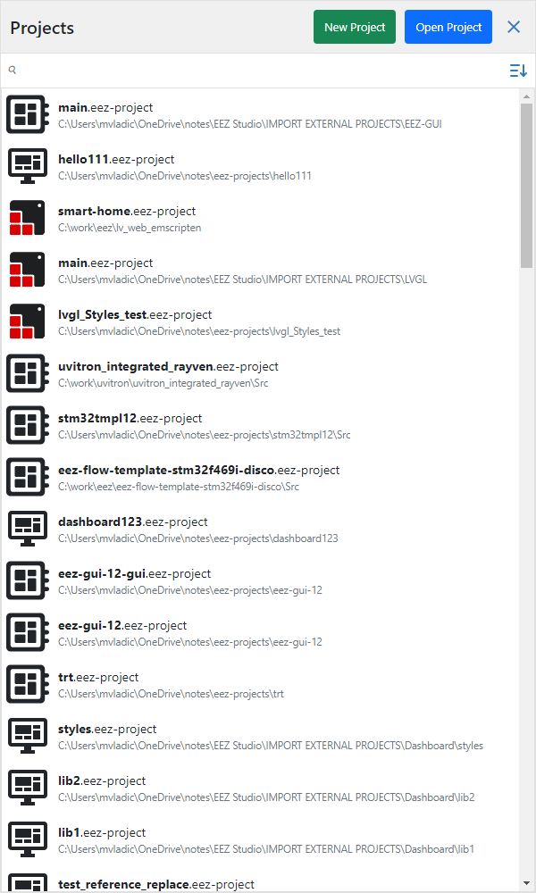

Features:

    -   new project
    -   open project
    -   recent projects list
        - lista svih do sada otvorenih projekata
    -   search box za brzo pronalaženje projekta u listi
    -   sort by name or by date
        - defaultno je sortiranje po datumu otvaranja projekta, a može se sortirati i po nazivu projekta
    -   remove project file from the list
        - X ikona za micanje projekta iz liste

# M14 Kreiranje novog projekta

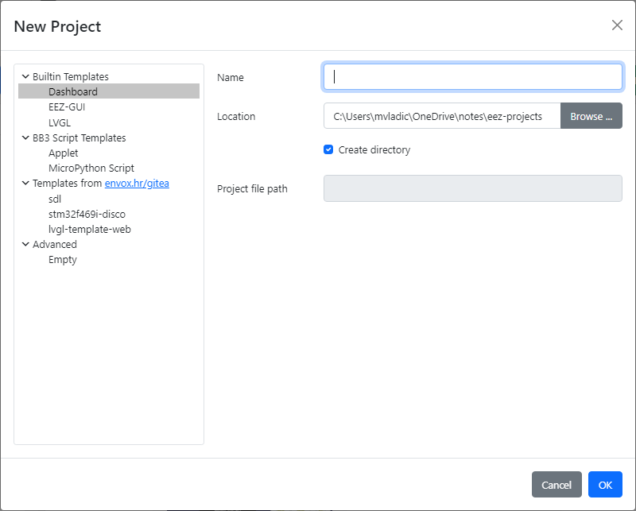

Templates:

-   Bultin
    -   Dashboard
        -   Projekt za izradu desktop aplikacija
    -   EEZ-GUI
        -   Projekt za izradu embedded GUI aplikacije pomoću EEZ-GUI frameworka.
    -   LVGL
        -   Projekt za izradu embedded GUI aplikacije pomoću LVGL frameworka.
-   BB3 Script
    -   Applet
        -   Projekt koji se izvršava na BB3 uređaju, baziran na eez-flow.
    -   Micropython Script
        -   Projekt koji se izvršava na BB3 uređaju, baziran na micropythonu.
-   From envox.hr/gitea
    -   Template projekti koji se nalaze na gitea. Uglavnom kompletni projekti spremni za buildanje, bazirani na EEZ-GUI.
-   Advanced
    -   Empty
        -   Ovo kreira prazan projekt, za napredno korištenje.

BB3 applet i micropython script template imaju step 2 u wizardu u kojem se zadaje master projekt od BB3-a. Master projekt je potreban jer BB3 skripte koriste stylove, fontove i theme iz tog projekta.

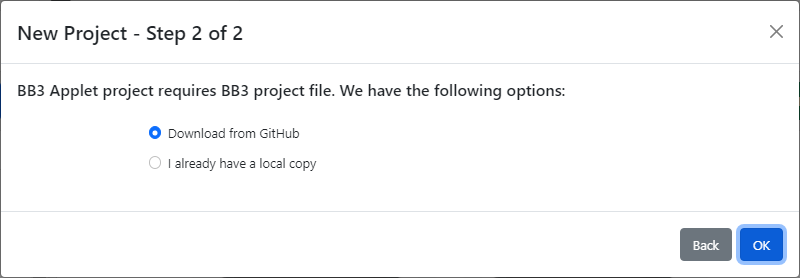

BB3 Micropython script template ima step 3 u wizardu u kojem se odabire verzija BB3 firmwara za koju je namjenjena skripta (1.7.x ili 1.8) zbog toga što se mijenjao format resourse fajla.

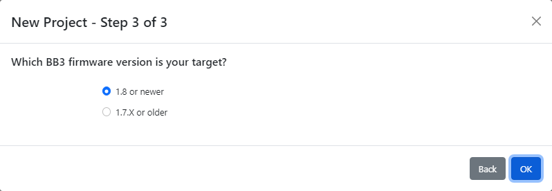

# M14 Overview of ProjectEditor GUI

Ovdje treba opisati generalno od čega se sastoji projekt editor GUI: toolbar, docking paneli, editori,...

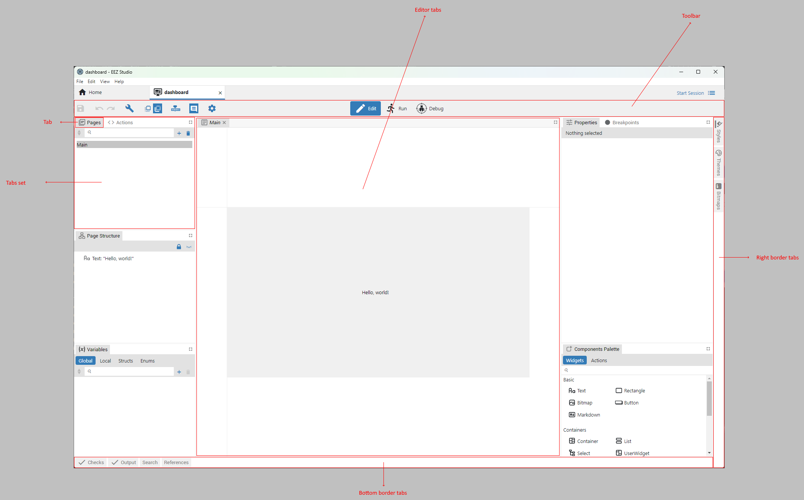

-   Project editor se sastoji od toolbara, panela i editora/viewera

-   Peneli i editori se nalaze unutar taba

-   Tabovi se nalaze unutar tabseta ili border stripa

-   Border strip tabovi se otvaraju klikom na tab i zatvaraju ponovnim klikom na tab. Samo jedan tab unutar border stripa može biti otvoren.

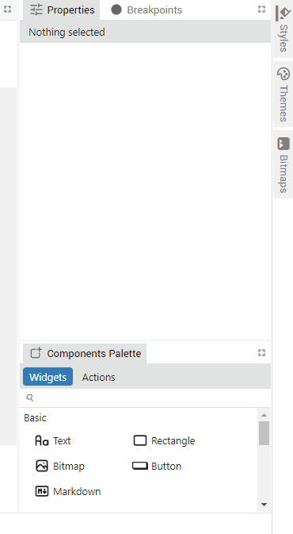

-   Border stripovi su mogući na sve četiri strane: top, right, bottom and left

-   Tabovi se mogu premjesitit iz jednog tabseta u drugi:

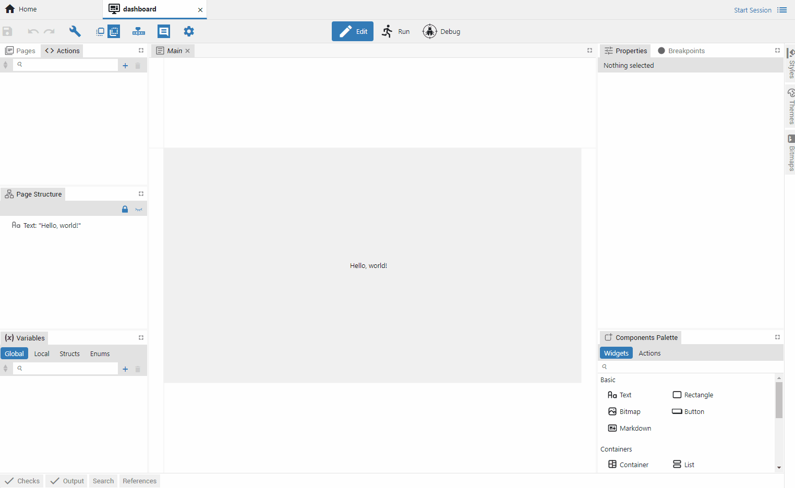

-   Tabovi se mogu premjesitit iz tabseta u border

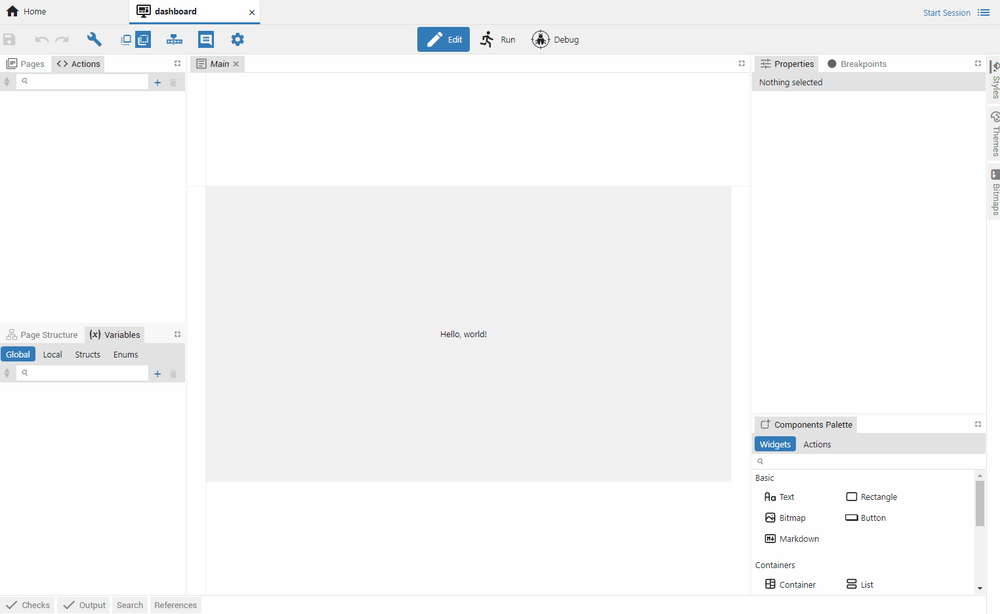

-   Tabovi se mogu premjesitit iz bordera u tabset.

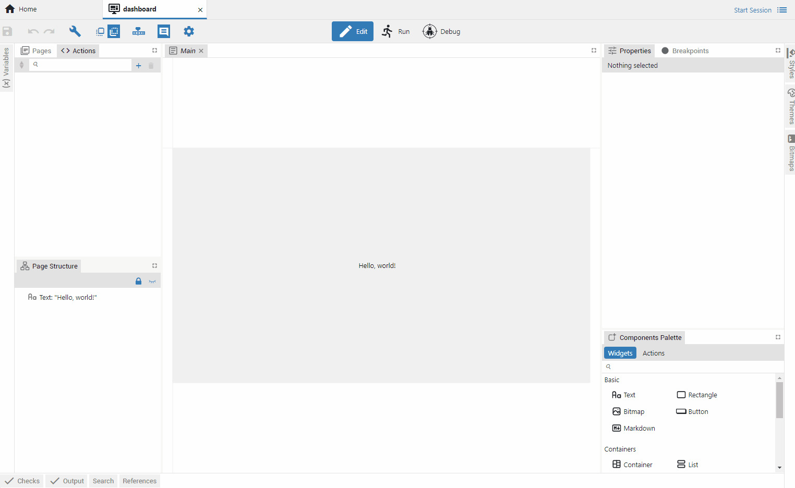

-   Čitav tabset se može premjestiti na neko drugo mjesto

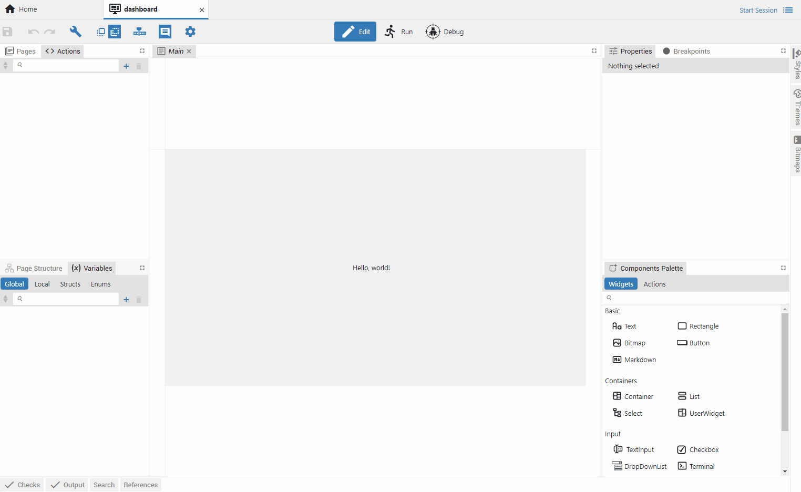

-   Panel se uvijek nalazi na ekranu, a editore možemo otvarati i zatvarati po želji. Npr. ako se klikne na page otvoriti će se page editor u tabu, ako se onda klikne na neki drugi page otvoriti će se untar tog taba (rejuza se tab). Editor tab se može ostaviti ta bude uvijek otvoren sa desnim klikom na tab i odabirom Keep tab open.

## M14 Project editor modes

-   3 moda rada: edit, run, debug

-   Ovo je omogućeno samo ako je Flow support enabled za projekt, inače je projekt editor uvijek u Edit modu. Pokazati gdje se u settingsima može enejblati flow.

-   U toolbaru se nalazi mode select buttoni.

-   Svaki mode ima drugačiji toolbar. S tim da se neki buttoni pojavljuju u više modova (Show front face, Show back fase, Show component descriptions).

-   Ono što su editori u Edit modu, u Run/Debug modu su vieweri. Tako imamo Page viewer (u Run i Debug modu) i Action viewer (samo Debug mode). Npr. page viewer prikazuje page isto kao i editor ali se tu ne može editirati.

-   Run mode prikazuje samo toolbar i active page viewer.

-   U Run i Debug modu nije moguće mijenati projekt nego samo pratiti izvršavanje projekta.

## M14 Toolbar

### M14 Toolbar in edit mode

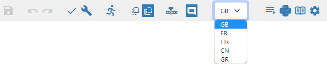

-   Save

-   Undo
-   Redo

-   Check
-   Build

-   Run MicroPython Script

    -   Ovaj button radi slijedeće:
        -   Builda projekt, rezultat je resuource fajl (.res).
        -   Uploada resource (.res) fajl i Micropython skriptu (\*.py) na odabrani BB3 uređaj
        -   Pokreće Micropython skriptu na BB3 uređaju
    -   Button je samo prisutan kod BB3 Micropython Script projekata (Project type je Resource) i ako je enejblan Micropython feature.

-   Show front face

    -   Prikazuje samo widgete bez action componenti i linija u page editoru.
    -   Ovaj button je prisutan ako je flow enabled u projektu i ako je page editor u fokusu.

-   Show back face

    -   Prikazuje sve komponente (i widgete i akcije) i linije u page editoru.
    -   Ovaj button je prisutan ako je flow enabled u projektu i ako je page editor u fokusu.

-   Show/Hide animation timeline editor

-   Show/Hide component descriptions

    -   Svaka komponenta ima Description property. S ovim buttonom biramo da li će se description vidjeti ispod komponente.
    -   Prisutan ako je odabran back face i ako je page editor u fokusu.

-   Language selector

    -   Ovaj button je prisutan ako je enejblan Texts feature i ako je definiran barem jedan language

-   Feature buttons

    -   Neki featuri ako su enejblani mogu dodati button u toolbar:
        -   Shortcuts
            -   Otvara editore shortcutova koji su dio IEXT definicije
        -   Micropython
            -   Otvara editor Micropython skripte
        -   Changes
            -   Otvar preglednik izmjena koje su napravljene u projektu (integracija sa git version control)

-   Settings
    -   Ovaj button otvara Settings editor

### M14 Toolbar in Debug Mode

-   Vide se samo ovi buttoni:
    -   Show front face
    -   Show back face
    -   Show/Hide component descriptions

### M14 Mode switcher

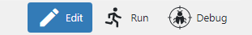

Mode switcher je prisutan ako je Flow support omogućen u projektu (Vidjeti Setting - General):

-   Edit
    -   Prebacuje project editor u Edit mod
-   Run
    -   Prebacuje project editor u Run mod
-   Debug
    -   Prebacuje project editor u Debug mod

### M14 Global variables status

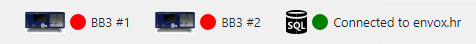

-   Ovo je prisutno samo u Run/Debug modu i ako projekt ima barem jednu globalnu varijablu tipa objekt, npr. Instrument connection ili PostgreSQL connection.

-   Za svaku objekt varijablu ovdje se prikazuje status i klikom na taj status može se npr. promijeniti instrument na koji se spaja ili parametre PostgreSQL konekcije. Status prikazuje ikonu, status konekcije (connected/disconnected) i title. Što se dešava kad se klikne na stutus ovisi o tipu objekt varijable.

## M14 Panels

Kratak opis svih panela. Može se staviti screenshot svakog panela.

-   Edit mode paneli

    -   Pages
        -   Prikaz svi stranica, dodavanje novih stranica, ...
    -   Actions
        -   Prikaz svi akcija, dodavanje novih akcija, ...
    -   Page structure
        -   Prikaz svih widgeta unutar otvorene stranice u editoru.
    -   Variables
        -   Globalne i lokalne varijable
        -   Definicije structure i enum tipova
    -   Properties
        -   Prikaz i editiranje propertija selektiranog objekta
    -   Breakpoints
        -   Lista breakpointsa
    -   Components Palette
        -   Lista svih widgeti i akcije koje se mogu dodati u page ili action. Koji widgeti i akcije se nalaze u paletti ovisi o tipu projekta.
    -   Styles
        -   Prikaz svih stilovi, dodavanje novog stila, ...
    -   Themes
        -   Prikaz svih thema i boja, dodavanje nove theme i boje, mijenjanje boje, itd.
    -   Bitmaps
        -   Prikaz svih bitmapa, dodavanje nove bitmape, ...
    -   Fonts
        -   Prikaz svih fontova, dodavanje novog fonta, ...
    -   Texts
        -   Za multilangugage projekte dodavanje jezika i uređivanje svih tekstova koji su multilanguage
    -   IEXT
        -   Definicija IEXT ekstenzije. Postoji File - Build Extensions u meniju za buildanje ekstenzije. Jedan projekt može definirati više IEXT ekstenzija
    -   SCPI
        -   Definiranje SCPI komandi koje se ubacuju u IEXT projekt
    -   Changes
        -   Lista svih commitova ako se projekt nalazi u git repozitoriju.
    -   Checks
        -   Čitavo vrijeme se u pozadini traže greške u projektu (npr. krivi expressioni) i pronađene greške će biti ispisane u ovom panelu.
    -   Outputs
        -   Ovdje se prikazuje report nakon buildanja i prijavljuju eventualne greške
    -   Search
        -   Pretraživanje projekta i prikaz pronađenih rezultata
    -   References
        -   Ovi objekti imaju mogućnost pronalaženja gdje se sve koriste u projektu: Variables, Struct, Enum, Page, Action, Style, Font, Bitmap. Desni klik na objekt i "Find all references", pronađene reference će biti prikazane u ovom panelu.

-   Debug mode paneli
    -   Pages
        -   Prikaz svih stranica u projektu, bez mogućnosti uređivanja.
    -   Actions
        -   Prikaz svih akcija u projektu, bez mogućnosti uređivanja.
    -   Active Flows
        -   Lista aktivnih flowova.
    -   Watch
        -   Prikaz svih varijabli i njihovih trenutnih vrijednost tijekom izvršavanja flowa
    -   Queue
        -   Prikaz svih komponenti u redu čekanja na izvršavanje
    -   Breakpoints
        -   Lista breakpointsa
    -   Logs
        -   Prikaz logova tijekom izvršavanja. Tipovi logova: Fatal, Error, Warning, Info, Debug i SCPI. Postoji filter koji se logovi prikazuju

## M14 Editors

-   Page editor
    -   Prikaz i uređivanje jedne stranice
-   Action editor
    -   Prikaz i uređivanje jedne akcije
-   Settings
    -   Uređivanje globalnih opcija projekta
-   Font editor
    -   Prikaz svih znakova u fontu. Mogućnost naknadnog dodavanja novog znaka ili brisanje znaka.
-   Shortcuts
    -   Prikaz i uređivanje shortcutova koji su dio IEXT definicije.
-   Micropython
    -   Editiranje micropython skripte
-   Readme
    -   Odabir i prikaz README fajla koji se može pridružiti projektu. Ovo služi kao pojašnjenje/podsjetnik onome tko otvara projekt npr. kako buildati projekt za native platformu.

## M14 Viewers

-   Page viewer (u Run modu i Debug modu, postoji razlike)
    -   Samo prikaz stranice bez mogućnosti uređivanja
    -   U Run modu se vide samo widgeti i uvijek je omogućena interakcija sa widgetima
    -   U Debug modu se prikazuju i akcije. Interakcija sa widgetima je omogućena, isto kao i u Run modu, ako je flow pokrenut. Ako je flow pauziran onda je interakcija sa widgetima onemogućena, tj. widget se mogu selektirati kako bi se vidjelo stanje na njegovim inputima u watch panelu, mogu se dodavati i brisati breakpointi.
-   Action viewer
    -   Samo prikaz akcije bez mogućnosti uređivanja
    -   U Debug modu se može vidjeti koje action komponente se trenutno izvršavaju.
    -   Ako je flow pauziran mogu se dodavati breakpointi i gledati koje vrijednosti ima komponenta na inputima

# M14 Editiranje projekta

## M14 Settings

## M14 Pages

-   ovo je opisano u draft/pages/pages.md

## M14 Actions

-   ovo je opisano u draft/actions/actions.md

## M14 Variables

-   ovo je opisano u draft/variables/variables.md

## M15 Styles

## M15 Fonts

## M15 Bitmaps

## Animation timeline editor

## Optional features

### Texts

### SCPI

### IEXT

### Shortcuts

### Changes

### MicroPython

### M15 Readme

## Check

## Search & Replace

# M14 Prinicipi rada Flow-a

-   ovo je opisano u draft/flow/flow.md

# Projekti bez Flow-a

Ovdje opisati što se može napraviti s projektom koji nema flow integraciju.

-   Samo EEZ-GUI i LVGL mogu biti bez flow integracije
-   Sve varijable i akcije su native, sve ostalo je isto.

# Build

# Izvršavanje projekta

## Run mode

## Debugging mode

### Breakpoints and steping through flow execution

### Debugging mode panels

Ovdje treba opisati panele koji se vide u debug modu.

# Project type specifics

## Dashboard

Ovdje treba opisati stvari koje su specifične za Dashboard projekte.

-   Opisati stilove specifične za Dashboard projekte (CSS).

-   Building Standalone applications

-   Instrument dashboards

## EEZ-GUI

Ovdje treba opisati stvari koje su specifične za EEZ-GUI projekte.

-   Opisati native integraciju, tj. sa C++,

-   Opisati stilove specifične za EEZ-GUI projekte.

## LVGL

Ovdje treba opisati stvari koje su specifične za LVGL projekte.

-   Opisati native integraciju, tj. sa C++,

-   Opisati stilove specifične za LVGL projekte

# M16 Widgets

-   Opis svih widget komponenti

-   Widget1
    -   Generalni opis
    -   Properties
    -   Flow Inputs
    -   Flow Outpts

# M17 Action Components

-   Opis svih actions komponenti

-   Action1
    -   Generalni opis
    -   Properties
    -   Flow Inputs
    -   Flow Outputs
