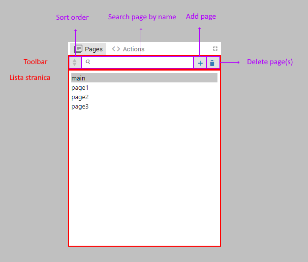
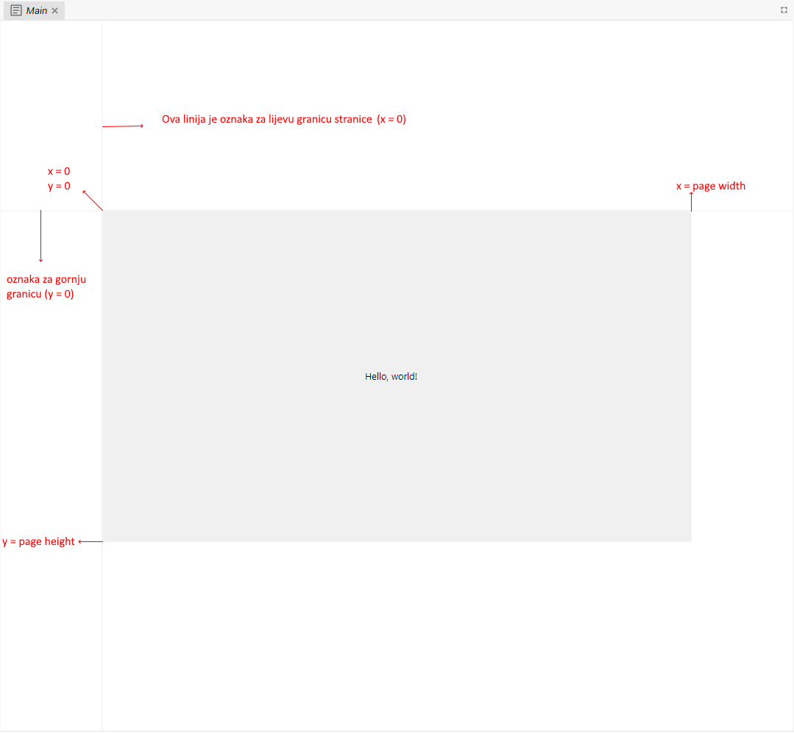
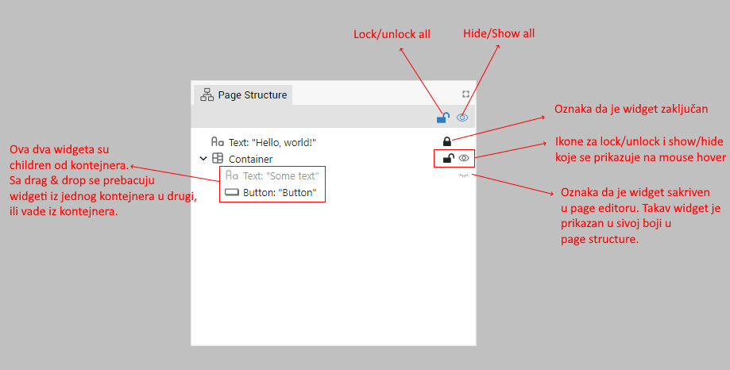
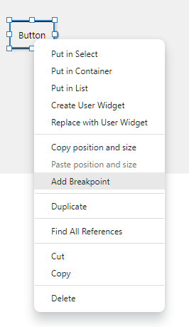

# Pages panel

Toolbar:

-   Sort order

    -   Ascending (gornja strelica je plava u ikoni)
    -   Descending (donja strelica je plava u ikoni)
    -   User sorting order (obje strelice su sive u ikoni)
        -   Koristeći drag and drop u listi stranica user sortira stranice
        -   Važno!: stranica koja je prva je MAIN PAGE, ona se prikazuje prva kod pokretanja

-   Search box: filtriranje po nazivu stranice

    -   Ako je nešto uneseno u search box onda je drag and drop u listi stranica onemogućen kod User sorting ordera

-   Add page

    -   Otvar dialog za unos naziva stranice
    -   Naziv nove stranice mora biti unique.
    -   Naziv stranice ne smije sadržavati točku ".". To je zato što se kod importanja točka koristi kao separator između naziva eksternog librarija (vidi Import As polje) i naziva stranice

-   Delete page(s)
    -   Briše sve selektirane stranice

Lista stranica:

-   Kada se klikne na stranicu otvara se njen editor
-   Moguće je selektirani više stranica
    -   Mouse click + CTRL: select/deselect page
    -   Mouse click + SHIFT: select multiple pages
-   Mouse click na prazno deselektira sve stranice
-   Desni klik otvara konteksni meni

# Page editor

-   Dodavanje novog widgeta: drag and drop iz Components palette/Widgets u Pages editor
-   Click na widget selektira widget
-   CTRL+Click ako se želi selektirati više widgeta
-   Za selektiranje više widgeta se može koristiti i tkz "rubber band selection" gdje se prvo treba kliknuti negdje gdje nema widgeta, zatim povući miša i pustiti tipku (prikazuje se rectangle i kad se otpusti miš selektirati će se svi widgeti unutar njega).
-   Selektirani widget se prikazuje u Properties panel
-   Properties panel je podržan i kada je više widgeta selektirano. Onda se sve izmjene rade na svim selektiranim widgetima
-   Za pomicanje widgeta unutar stranice se koristi drag and drop
    -   Svi selektirani widgeti se pomiču
    -   Ovdje se by default radi snap to snap lines, a ako se to ne želi onda je potrebno pritisnuti SHIFT
-   Mouse wheel pomiče stranicu vertikalno unutar page editora, a SHIFT+Mouse wheel horizontalno
-   Stranicu je moguće pomicati i sa srednjim ili desnim buttonom
-   CTRL+Mouse wheel se koristi za zoomiranje stranice
-   Double click centrira stranicu unutar page editora (resetira pomak i zoom)

# Page structure panel

-   Prikazuje sve widgete kao tree struktura
-   I ovdje se mogu selektirati widgeti
-   Kroz ovaj panel se mogu prebacivati widgeti iz jednog containera u drugi - za to se koristi drag and drop
-   Lock/unlock pojedinog widgeta (on mouse hover se pokazuju ikone)
    -   Lockani widgeti se ne mogu selektirati kroz page editor
-   Lock/unlock all
-   Hide/show pojedinog widgeta (on mouse hover se pokazuju ikone)
    -   Ovo služi samo tijekom editiranja. Napomena: Ako se želi tijekom izvršavanja sakriti widget za to se koristi Visible property.
-   Hide/show all

# Widget context menu

-   Moguće je selektirati više widgeta i ubaciti ih u Container widget (Put in Container), Select widget (Put in Select) ili List widget (Put in List). Što se tiče Select widgeta i List widgeta, više o ovome kada budemo specificirali ta dva widgeta.

-   Moguće je kreirati i User widget iz selektiranih widgeta (Create User Widget). Znači kreira se novi user widget koji sadrži selektirane widgete, a na mjesto selektiranih widgeta se ubaci taj novi user widget. Ako već postoji user widget onda je moguće selektirane widget zamijeniti s njim (Replace with user widget). Npr. ako na nekoj stranici imamo ponavljanje neke skupine widgeta onda prvo Create User widget a nakon toga Replace with User Widget.

-   Copy position and Size i Paste pozition and size se koristi ako se nekom widgetu želi postaviti ista pozicija i size kao što je ima neki drugi widget. Znači prvo se ide desni click na widget čija se pozicija i size želi kopirati i odabere se Copy position and size, zatim na drugi widget i Paste position and size i nakon toga će imati oba istu poziciju i size. Ovo je korisno kod Select widgeta, koji sadrži više widgeta ali se samo jedan od njih tijekom izvršavanja prikazuje npr. ovisno o nekoj varijabli. S tim da svi widgeti moraju imati istu poziciju i size, pa se na ovaj način to najlakše postiže (drugi način je preko properties panela i uređivanja X, Y, Width i Height propertija)

-   Add breakpoint (ovo je vezano za Flow debugging i tamo će biti objašnjeno)

-   Duplicate

-   Cut, Copy i Delete

# User widgeti

-   Za kreiranje user widgeta se isto koristi Pages panel
-   Potrebno je kreirati page i onda u properties odabrati [x] Is used as user widget
-   Takav page/user widget će u Pages panelu biti označen sa "[USER WIDGET]"
-   Svi user widgeti se prikazuju u Components paleti i sa drag and drop se mogu dodavati u stranice ili druge user widgete.

# Flow

-   Page je ujedno i flow, što znači da se u njega mogu dodavati i action componente i vrijedi sve što vrijedi i za actions flowove
