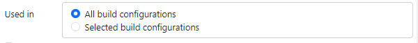

# General

-   Project type

    -   Mogući tipovi: "Dashboard", "EEZ-GUI", "LVGL", "BB3 MicroPython Script", "BB3 Applet"
    -   Ovo se kod kreiranja projekta popuni i ne može se kasnije mijenjati

-   Target BB3 firmware

    -   Only: BB3 MicroPython Script
    -   Vrijednosti: "1.7.X or older" ili "1.8 or newer"

-   Master project

    -   Only: BB3 Applet, BB3 MicroPython Script
    -   Ovo se već kod kreiranja projekta popuni (modular-psu-firmware.eez-project)

-   Extensions

    -   Ovo je lista ekstezija koje projekt koristi

-   Import

    -   Ovo je lista eksternih projekata koje projekt koristi
    -   Rad sa eksternim projektima će biti naknadno opisan (M16 ili M17)

-   Title

    -   Only: Dasboard
    -   Ovo je naziv standalone aplikacije ili instrument dashboarda

-   Icon

    -   Only: Dasboard
    -   Ovo je ikona standalone aplikacije ili instrument dashboarda

-   Display width

    -   Only: EEZ-GUI, LVGL

-   Display height

    -   Only: EEZ-GUI, LVGL

-   Flow support

    -   Only: EEZ-GUI, LVGL

-   Description

    -   Ovo je opis projekta koji se vidi u Examples sekciji

-   Image

    -   Ovo je slika koja se vidi u Examples sekciji

-   Keywords

    -   Ovo su keywordi koji se vidi u Examples sekciji

-   Target platform

    -   Ovo je opis target platforme kojii se vidi u Examples sekciji

-   Target platform link

    -   Ovo je link na website od target platforme koji se vidi u Examples sekciji

-   Resource files

    -   Ovo je lista eksternih fajlova koje examples koristi. Npr. to može biti `.py` fajl koji koristi Python example, ili `.csv` fajl koji koristi CSV example, itd.

-   Project features
    -   Dodavanje/micanje opcionalnih featurea projekta

# Build

-   Only: EEZ-GUI, LVGL

-   Destination folder

    -   Folder u koji će se ubaciti buildani fajlovi

-   LVGL include
    -   Only: LVGL
    -   Ovo je path do `lvgl.h` header fajla. Normalno je to `lvgl/lvgl.h`, a ali ako se nalazi na nekom drugom mjestu onda se to može tu specificirati.

## Files

-   Only: EEZ-GUI, LVGL
-   Lista source fajlova templejtova iz kojih će se izgenerirati source fajlovi
-   Ovo je sve pripremljeno već tijekom kreiranja projekta iz wizarda.
-   Detalji će biti opisani u novom poglavlju koji će se zvati Native integracija (M16 ili M17)

## Configurations

Only: EEZ-GUI

Project može definirati više build konfiguracija. Npr. ovo se koristi ako isti projekt koristimo za buildanje native firmware za hw board i za simulator, a ne želimo u buildane fajlove za hw board uključiti resourse koji se koriste samo za simulator i obrnuto. Za Page, Action, SCPI command, Shortcut i Variable možemo naznačiti u kojoj konfiguraciji se koriste. Za to se koristi `Used in` property:



-   Name

    -   Naziv build konfiguracije

-   Description

    -   Opis build konfiguracije

-   Properties

    -   Ovo se koristi za IEXT za specificiranje dodatnih opcija IEXT-a
    -   Zadaje se u JSON formatu
    -   U IEXT definiciji je naznačeno koja konfiguracija se koristi:

    

    -   Ovo si vjerojatno već opisao u poglavlju kreiranje IEXT ekstenzija. Ovo su moguće opcije:

```
{
  connection?: {
        ethernet?: {
            port: number;
        };
        serial?: {
            baudRates: number[];
            defaultBaudRate: number;
            defaultDataBits: 8 | 7 | 6 | 5;
            defaultStopBits: 1 | 2;
            defaultParity: "none" | "even" | "mark" | "odd" | "space";
            defaultFlowControl: "none" | "xon/xoff" | "rts/cts";
        };
        usbtmc?: {
            idVendor: number | string | undefined;
            idProduct: number | string | undefined;
        };
        webSimulator?: {
            src: string;
            width: number;
            height: number;
        };
    };
    channels?: {
        maxVoltage?: number;
        maxCurrent?: number;
        maxPower?: number;
    }[];
    lists?: {
        maxPoints?: number;
        minDwell?: number;
        maxDwell?: number;
        dwellDigits?: number;
        voltageDigits?: number;
        currentDigits?: number;
    };
    fileDownload?: {
        shortFileName?: boolean;
        startCommand?: string;
        fileSizeCommand?: string;
        sendChunkCommand?: string;
        finishCommand?: string;
        abortCommand?: string;
        chunkSize?: number;
        favoriteDestinationPaths?: {
            ext?: string;
            path: string;
        }[];
    };
}
```
