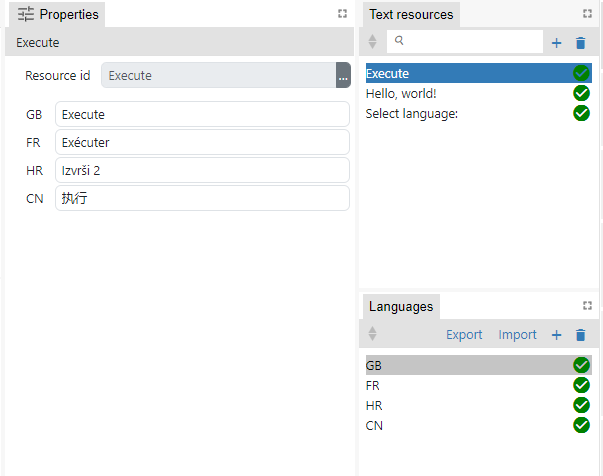
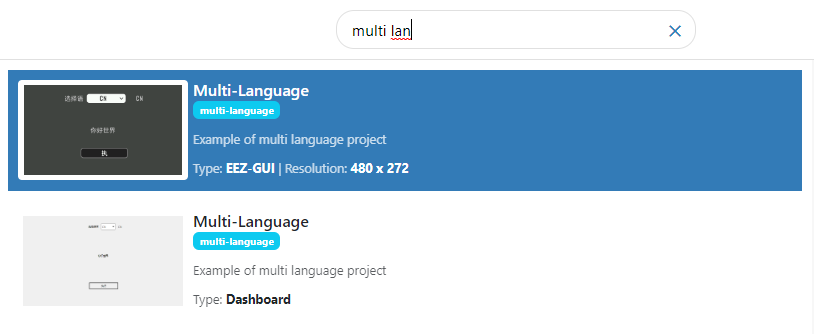

Ovdje imamo Texts panel u kojem definiramo:

-   listu Text Resource ID's
-   listu Languagea
-   Za svaki language i text resource ID treba unjeti prijeved
-   Statistics tab prikazuje koliko je toga prevedeno

Znači kad se selektira text resource ID onda u properties se unesu prijevodi:

Imamo akciju SelectLanguage s kojom se u runtimeu bira aktivni language.

U expressionima ako želimo koristiti neki lokalizirani tekst onda to možemo napraviti na dva načina:

1. Koristeći poseban literal `T"<text resource ID>"`. Npr. T"Hello, world!" gdje je "Hello, world!" jedan od ID-jeva u Text Resources tabu.
2. Pomoću funkcije `Flow.translate("<text resource ID>")`. Npr. Flow.translate("Hello, world!")

Jasno je da je jednostavije koristiti `T"<text resource ID>"` pa se to i preporuča.

Ako za neki jezik trenutno ne postoji prijevod onda će se koristiti sam text resource ID, pa je zgodno da taj ID bude npr. isti kao i prijevod za neki od jezika npr. Engleski.

Imamo dva example za multi language koji koristi Texts feature:

Jedan je Dashboard, a drugi EEZ-GUI projekt. LVGL za sada nije podržan.
