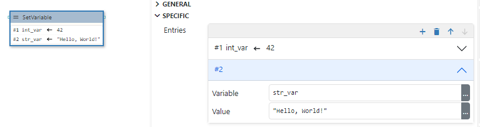
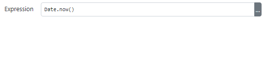
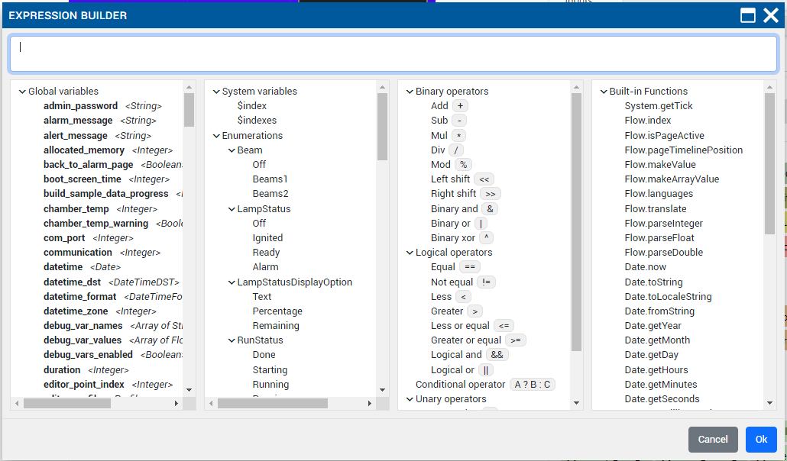

# Variables

-   A variable stores data that can be changed later on

-   Project with flow support can have both global and local variables. Global variables are visible from all flows, local variables are visible only inside the flow in which it is defined.

-   Project without flow support can have only global variables and those variables must be native.

-   Native variables are variables managed by the native code (written in C++).

    -   Dashboard project can't have native variables.
    -   Napomena: kako se definiraju native varijable u C++-u će biti opisano u zasebnom chapteru i to ne moramo opisati u M14.

-   To add variable in project use Variables panel

-   Variable properties:

    -   Name.
        -   Variable is referenced in other parts of project by its name
        -   Rules for name:
            -   Starts with a letter or an underscore (\_), followed by zero or more letters, digits, or underscores. Spaces are not allowed.
    -   Description (optional)
    -   Type
        -   The type of data stored in this variable
    -   [x] Native
    -   Default value
        -   Initial value of variable when flow starts
        -   Given in JSON notation (https://www.json.org/json-en.html)
        -   For example: `123`, `"Hello"`, `true`
        -   If types is struct:
            -   `{ "member1": 42, "member2": "Hello" }`
        -   If type is array:
            -   `[1, 2, 3]`
            -   `["string1", "string2", "string3"]`
    -   Used in
        -   See Configurations in Settings (ovo neće biti opisano u M14)
    -   Persistent (only for global variables)
        -   Store the last value of variable in .eez-runtime-settings file, so when projects starts next time it will have this value not default value.
        -   This is only supported for Dashboard projects.

-   Usage of variables
    -   In the project with flow support
        -   The data stored in variable can be accessed using expressions
        -   In Action components
            -   Evaluate
                -   Evaluates expression, which can use variables, and sends the result through "result" data line
            -   Watch
                -   Watch expression for change. Sends changed value through "changed" data line.
                -   Always sends current value when flow starts, and later when evaluated expression has been changed.
            -   SetVariable
                -   Modifies the data value stored in variable



                - Multiple entries
                - Each entry is defined by the variable and expression field.
                - Stores evaluated expression to variable.


            -   SwitchCase, Compare, IsTrue
                -   Used for branching inside the flow depending of the data stored in variable
        -   In Widget components
            -   Some properties of the widgets can be defined by expression.
            -   Which means the value of this property will be changed in the runtime every time evaluated expression has been changed
            -   For example, Label widget can show the content of some variable, and it will updated every time this variable has been modified.

# Variable types

## Basic/Primitive types

-   Integer

    -   Signed 32-bit integer

-   Float

    -   IEEE 4-byte floating-point

-   Double

    -   IEEE 8-byte floating-point

-   Boolean

    -   Can hold true of false value.

-   String

    -   Sequance of characters

-   Date

    -   Unix timestamp

-   Blob

    -   Binary large object
    -   Only in Dashboard projects

-   Stream

    -   Stream of data
    -   Only in Dashboard projects

-   Any
    -   Can hold any data type

## Structures

-   Structure types are defined in Variables panel in Structs section.
-   Only supported in projects with flow support enabled
-   Struct type variable stores multiple data values each accessed by its member name
-   Each member is defined by its name and type

## Enums

-   Enums types are defined in Variables panel in Enums section.
-   Enum type variable stores integer data value, but can contain only restricted set of values.
-   Each enum member is defined by its name and integer value

## Objects

-   Only Dashboard project can have object variables
-   Example of object variables: Instrument connection, PostgreSQL connection
-   Object variables, simular to structs, can hold multiple values, each accessed by member names. The member names depends of the type of Object variable.
-   Napomena: Dodati novi chapter za object varijable, gdje bi se one detaljno opisale. Ovo ne mora biti u M14.

## Arrays

-   Array variable stores multiple data values

# Expressions

-   Expression contains instructions for the flow execution runtime how to evaluate data value.

-   Expression definition is given in code which is similar to JavaScript and other C-like languages

-   Expression elements:
    -   Literal value
        -   Example: `42`, `"Hello"`, `true`
    -   Variable names
        -   Example: `my_var`
    -   Input names
        -   Retrieves the data stored in data input using the name of that input
        -   Example: `input_name`
    -   Operators
        -   Binary
            -   Example: `my_integer_var + 1`
        -   Logical
            -   Example: `my_integer_var < 10`
        -   Unary
            -   Example: `-my_integer_var`
        -   Ternary
            -   Example: `my_integer_var == 1 ? true : false`
                -   evaluates to `true` if `my_integer_var` is `1`, otherwise evaluates to `false`
    -   Function calls
        -   For example: `String.length(my_string_var)`
    -   Parentheses () for specifying the order of the evaluation
        -   For example: `"Counter: " + (a + 1)`
    -   Structure type member accessor by using "."
        -   Example: `my_struct_var.member1`
    -   Array element accessor by using "[]"
        -   Example: `my_array_var[3]`, `my_array_var[index]`
    -   Enum value
        -   Example: `MyEnumTypeName.Member1`

Expression examples:

    - `var[i].member1`
        - `var` is array which contains structs, which has member `member1`
        - `i` is integer variable
        - evaluates to `member1` value in the i-th element

    - `var == State.START || var == State.EMPTY`
        - var is of type enum:State, and State enum has two members: START and EMPTY)
        - evaluates to true if var contains data that is either State.START or State.EMPTY

## Literals

    - Integer literal: `42`
    - Float or double literal: `3.14`
    - String literal: `"Hello, wordl!"`
    - Translated string literal: T"text_resource_id"
    - Boolean literal: `true` or `false`
    - JSON (https://www.json.org/json-en.html)

## Binary Opearators

Each binary operators requires two arguments. Binary operator is written between arguments, for example: `<arg1> + <arg2>`

`+` Addition

    - If any of the arguments is string then result is string.
        - For example, `voltage + " V"` will evaluta to `"1.5 V"` if data stored in voltage variable is `1.5`

    - If any of the arguments is double then result is double

    - If one argument is float and the other is float or integer the result will be float

    - If both arguments are integers then result is integer.

    - Znači ovo je tablica:

```
        arg1\arg2  integer float  double string boolean other_type

        integer    integer float  double string integer err
        double     double  double double string double  err
        float      float   float  double string float   err
        string     string  string string string string  err
        boolean    integer float  double string integer err
        other_type err     err    err    err    err     err
```

`-` Subtraction

```
        arg1\arg2  integer float  double boolean other_type

        integer    integer float  double integer err
        double     double  double double double  err
        float      float   float  double float   err
        boolean    integer float  double integer err
        other_type err     err    err    err     err
```

`*` Multiplication

```
        arg1\arg2  integer float  double boolean other_type

        integer    integer float  double integer err
        double     double  double double double  err
        float      float   float  double float   err
        boolean    integer float  double integer err
        other_type err     err    err    err     err
```

`/` Division

```
        arg1\arg2  integer float  double boolean other_type

        integer    double  float  double double  err
        double     double  double double double  err
        float      float   float  double float   err
        boolean    double  float  double double  err
        other_type err     err    err    err     err
```

`%` Remainder

```
        arg1\arg2  integer float  double boolean other_type

        integer    integer float  double integer err
        double     double  double double double  err
        float      float   float  double float   err
        boolean    integer float  double integer err
        other_type err     err    err    err     err
```

`<<` Left shift

```
        arg1\arg2  integer boolean other_type

        integer    integer integer err
        boolean    integer integer err
        other_type err     err     err
```

`>>` Right shift

```
        arg1\arg2  integer boolean other_type

        integer    integer integer err
        boolean    integer integer err
        other_type err     err     err
```

`&` Binary And

```
        arg1\arg2  integer boolean other_type

        integer    integer integer err
        boolean    integer integer err
        other_type err     err     err
```

`|` Binary Or

```
        arg1\arg2  integer boolean other_type

        integer    integer integer err
        boolean    integer integer err
        other_type err     err     err
```

`^` Binary Xor

```
        arg1\arg2  integer boolean other_type

        integer    integer integer err
        boolean    integer integer err
        other_type err     err     err
```

## Logical operators

-   These are also binary operators which results to boolean value

`==` equal to

`!=` not equal

`<` greater than

`>` less than

`<=` less than or equal to

`>=` greater than or equal to

`&&` and

`||` or

## Unary operators

`-` negate the value

`~` binary invert

`!` logical invert

## Conditional (ternary) operator

The conditional (ternary) operator is the only operator that takes three operands: a condition followed by a question mark (?), then an expression to execute if the condition is truthy followed by a colon (:), and finally the expression to execute if the condition is falsy.

## Functions

### System

-   `System.getTick`
    -   Description: Retrieves the number of milliseconds that have elapsed since the flow execution was started.
    -   Parameters:
        -   none
    -   Return value:
        -   Type: `integer`. Description: value in milliseconds

### Flow

-   `Flow.index`

    -   Description: Index of current element in the List and Grid widget. Check the description of these two widget for the more information.
    -   Parameters:
        -   Name: `index`. Type: `integer`. Description: in case of nested List/Grid widgets use 0 for inner most List/Grid, 1 for List/Grid one up, etc.
    -   Return value:
        -   Type: `integer`. Description: element index

-   `Flow.isPageActive`

    -   Description: If this function is executed inside the page it will return true if that page is currently active page, otherwise it will return false.
    -   Parameters:
        -   none
    -   Return value:
        -   Type: `boolean`. Description: true if page is active, false if page is not active

-   `Flow.pageTimelinePosition`

    -   Description: If this function is executed inside the page or custom widget it will return the current position at the animation timeline for that page or custom widget.
    -   Parameters:
        -   none
    -   Return value:
        -   Type: `boolean`. Description: timeline position

-   `Flow.makeValue`

    -   Description: Creates a new value of type struct.
    -   Parameters:
        -   Name: `structName`. Type: `string`. Description: structure name
        -   Name: `value`. Type: `JSON`. Description: structure value
    -   Return value:
        -   Type: `struct`. Description: created struct value

-   `Flow.makeArrayValue`

    -   Description: Creates a new value of type array
    -   Parameters:
        -   Name: `value`. Type: `JSON`. Description: array value
    -   Return value:
        -   Type: `array`. Description: created array value

-   `Flow.languages`

    -   Description: Retrives a list of languages defined in multilanguage project as array of strings.
    -   Parameters:
        -   none
    -   Return value:
        -   Type: `array:string`. Description: array of languages

-   `Flow.translate`

    -   Description: Translate text resource ID, same as `T"textResourceID"`
    -   Parameters:
        -   Name: `textResourceID`. Type: `string`. Description: text resource ID
    -   Return value:
        -   Type: `string`. Description: translated string

-   `Flow.parseInteger`

    -   Description: Parse integer value given as string
    -   Parameters:
        -   Name: `str`. Type: `string`. Description: input string
    -   Return value:
        -   Type: `integer`. Description: Parsed integer value

-   `Flow.parseFloat`

    -   Description: Parse float value given as string
    -   Parameters:
        -   Name: `str`. Type: `string`. Description: input string
    -   Return value:
        -   Type: `float`. Description: Parsed float value

-   `Flow.parseDouble`

    -   Description: Parse double value give as string
    -   Parameters:
        -   str `str`. Type: `string`. Description: input string
    -   Return value:
        -   Type: `double`. Description: Parsed double value

### Date

-   `Date.now`

    -   Description: Returns current date
    -   Parameters:
        -   none
    -   Return value:
        -   Type: `now`. Description: current datetime

-   `Date.toString`

    -   Description: Converts given date to string
    -   Parameters:
        -   str `date`. Type: `date`. Description: input date
    -   Return value:
        -   Type: `string`. Description: date string

-   `Date.toLocaleString`

    -   Description: Converts given date to locale string
    -   Parameters:
        -   str `date`. Type: `date`. Description: input date
    -   Return value:
        -   Type: `string`. Description: date string

-   `Date.fromString`

    -   Description: Converts string to date
    -   Parameters:
        -   Name: `dateStr`: Type: `string`. Description: input string
    -   Return value:
        -   Type: `date`. Description: date

-   `Date.getYear`

    -   Description: Get year from date.
    -   Parameters:
        -   Name: `date`. Type: `date`. Description: input date
    -   Return value:
        -   Type: `integer`. Description: year

-   `Date.getMonth`

    -   Description: Get month from date (1 to 12).
    -   Parameters:
        -   Name: `date`. Type: `date`. Description: input date
    -   Return value:
        -   Type: `integer`. Description: year

-   `Date.getDay`

    -   Description: Get day of the month from date (1 to 32).
    -   Parameters:
        -   Name: `date`. Type: `date`. Description: input date
    -   Return value:
        -   Type: `integer`. Description: day

-   `Date.getHours`

    -   Description: Get hours from date (0 to 23).
    -   Parameters:
        -   Name: `date`. Type: `date`. Description: input date
    -   Return value:
        -   Type: `integer`. Description: hours

-   `Date.getMinutes`

    -   Description: Get minutes from date (0 to 59).
    -   Parameters:
        -   Name: `date`. Type: `date`. Description: TODO
    -   Return value:
        -   Type: `integer`. Description: minutes

-   `Date.getSeconds`

    -   Description: Get seconds from date (0 to 59).
    -   Parameters:
        -   Name: `date`. Type: `date`. Description: TODO
    -   Return value:
        -   Type: `integer`. Description: seconds

-   `Date.getMilliseconds`

    -   Description: Get milliseconds from date (0 to 999).
    -   Parameters:
        -   Name: `date`. Type: `date`. Description: TODO
    -   Return value:
        -   Type: `integer`. Description: milliseconds

-   `Date.make`

    -   Description: Make a date from arguments.
    -   Parameters:
        -   Name: `year`. Type: `integer`. Description: Year
        -   Name: `month`. Type: `integer`. Description: Month
        -   Name: `day`. Type: `integer`. Description: Day
        -   Name: `hours`. Type: `integer`. Description: Hours
        -   Name: `minutes`. Type: `integer`. Description: Minutes
        -   Name: `seconds`. Type: `integer`. Description: Seconds
        -   Name: `milliseconds`. Type: `integer`. Description: Milliseconds
    -   Return value:
        -   Type: `date`. Description: constructed date

### Math

-   `Math.sin`

    -   Description: Returns the sine of a number in radians
    -   Parameters:
        -   Name: `x`. Type: `integer|float|double`. Description: A number representing an angle in radians.
    -   Return value:
        -   Type: `float|double`. Description: The sine of x, between -1 and 1, inclusive.

-   `Math.cos`

    -   Description: Returns the cosine of a number in radians
    -   Parameters:
        -   Name: `x`. Type: `integer|float|double`. Description: A number representing an angle in radians.
    -   Return value:
        -   Type: `float|double`. Description: The sine of x, between -1 and 1, inclusive.

-   `Math.pow`

    -   Description: Returns the value of a base raised to a power.
    -   Parameters:
        -   Name: `base`. Type: `integer|float|double`. Description: The base number.
        -   Name: `exponent`. Type: `integer|float|double`. Description: The exponent number.
    -   Return value:
        -   Type: `float|double`. Description: A number representing base taken to the power of exponent.

-   `Math.log`

    -   Description: Returns the natural logarithm (base e) of a number.
    -   Parameters:
        -   Name: `x`. Type: `integer|float|double`. Description: A number greater than or equal to 0.
    -   Return value:
        -   Type: `float|double`. Description: The natural logarithm (base e) of x

-   `Math.log10`

    -   Description: Returns the base 10 logarithm of a number.
    -   Parameters:
        -   Name: `x`. Type: `integer|float|double`. Description: A number greater than or equal to 0.
    -   Return value:
        -   Type: `float|double`. Description: The base 10 logarithm of x.

-   `Math.abs`

    -   Description: Returns the absolute value of a number.
    -   Parameters:
        -   Name: `x`. Type: `integer|float|double`. Description: A number.
    -   Return value:
        -   Type: `integer|float|double`. Description: The absolute value of x. If x is negative (including -0), returns -x. Otherwise, returns x. The result is therefore always a positive number or 0.

-   `Math.floor`

    -   Description: Always rounds down and returns the largest integer less than or equal to a given number.
    -   Parameters:
        -   Name: `x`. Type: `integer|float|double`. Description: A number.
    -   Return value:
        -   Type: `integer|float|double`. Description: The largest integer smaller than or equal to x. It's the same value as -Math.ceil(-x).

-   `Math.ceil`

    -   Description: Always rounds up and returns the smaller integer greater than or equal to a given number.
    -   Parameters:
        -   Name: `x`. Type: `integer|float|double`. Description: A number.
    -   Return value:
        -   Type: `integer|float|double`. Description: The smallest integer greater than or equal to x. It's the same value as -Math.floor(-x).

-   `Math.round`

    -   Description: Returns the value of a number rounded to the nearest integer.
    -   Parameters:
        -   Name: `value`. Type: `integer|float|double`. Description: A number.
    -   Return value:
        -   Type: `integer|float|double`. Description: The value of x rounded to the nearest integer.

-   `Math.min`

    -   Description: Returns the smallest of the numbers given as input parameters.
    -   Parameters:
        -   Name: `value1`, ..., `valueN`. Type: `integer|float|double`. Description: Zero or more numbers among which the lowest value will be selected and returned.
    -   Return value:
        -   Type: `integer|float|double`. Description: The smallest of the given numbers.

-   `Math.max`
    -   Description: Returns the largest of the numbers given as input parameters
    -   Parameters:
        -   Name: `value1`, ..., `valueN`. Type: `integer|float|double`. Description: Zero or more numbers among which the largest value will be selected and returned.
    -   Return value:
        -   Type: `integer|float|double`. Description: The largest of the given numbers.

### String

-   `String.length`

    -   Description: Returns the length of the string.
    -   Parameters:
        -   Name: `string`. Type: `string`. Description: A string.
    -   Return value:
        -   Type: `integer`. Description: The length of a string.

-   `String.substring`

    -   Description: Returns the part of the string from the start index up to and excluding the end index, or to the end of the string if no end index is supplied.
    -   Parameters:
        -   Name: `string`. Type: `string`. Description: A string.
        -   Name: `start`. Type: `string`. Description: The index of the first character to include in the returned substring.
        -   Name: `end`. Optional: `Yes`. Type: `string`. Description: The index of the first character to exclude from the returned substring.
    -   Return value:
        -   Type: `string`. Description: A new string containing the specified part of the given string.

-   `String.find`

    -   Description: Searches a string and returns the index of the first occurrence of the specified substring.
    -   Parameters:
        -   Name: `string`. Type: `string`. Description: A string.
        -   Name: `substring`. Type: `string`. Description: Substring to search for.
    -   Return value:
        -   Type: `string`. Description: The index of the first occurrence of substring found, or -1 if not found.

-   `String.padStart`

    -   Description: Pads the current string with another string (multiple times, if needed) until the resulting string reaches the given length.
    -   Parameters:
        -   Name: `string`. Type: `string`. Description: A string.
        -   Name: `targetLength`. Type: `integer`. Description: The length of the resulting string once the current str has been padded. If the value is less than or equal to str.length, then str is returned as-is.
        -   Name: `padString`. Type: `string`. Description: The string to pad the current str with. If padString is too long to stay within the targetLength, it will be truncated from the end.
    -   Return value:
        -   Type: `string`. Description: A String of the specified targetLength with padString applied from the start.

-   `String.split`
    -   Description: Takes a separator parameter and divides a String into an ordered list of substrings by searching for the separator pattern, puts these substrings into an array, and returns the array.
    -   Parameters:
        -   Name: `string`. Type: `string`. Description: A string.
        -   Name: `separator`. Type: `integer`. Description: The pattern describing where each split should occur.
    -   Return value:
        -   Type: `array:string`. Description: An Array of strings, split at each point where the separator occurs in the given string.

### Array

-   `Array.length`

    -   Description: The number of elements in given array.
    -   Parameters:
        -   Name: `array`. Type: `array`. Description: An array.
    -   Return value:
        -   Type: `integer`. Description: The length of an array.

-   `Array.slice`

    -   Description: returns a shallow copy of a portion of an array into a new array object selected from start to end (end not included) where start and end represent the index of items in that array. The original array will not be modified.
    -   Parameters:
        -   Name: `array`. Type: `array`. Description: An array.
        -   Name: `start`. Type: `integer`. Description: Zero-based index at which to start extraction
        -   Name: `end`. Optiona: `Yes`. Type: `integer`. Description: Zero-based index at which to end extraction
    -   Return value:
        -   Type: `array`. Description: A new array containing the extracted elements.

-   `Array.allocate`

    -   Description: Creates a new array of given size.
    -   Parameters:
        -   Name: `size`. Type: `array`. Description: A size number.
    -   Return value:
        -   Type: `array`. Description: A new array

-   `Array.append`

    -   Description: To an existing array appends an element to the end and returns a new array. The original array will not be modified.
    -   Parameters:
        -   Name: `array`. Type: `array`. Description: An array.
        -   Name: `value`. Type: `any`. Description: Element value to be appended
    -   Return value:
        -   Type: `array`. Description: A new array with appended element.

-   `Array.insert`

    -   Description: To an existing array inserts an element at given position and returns a new array. The original array will not be modified.
    -   Parameters:
        -   Name: `array`. Type: `array`. Description: An array.
        -   Name: `position`. Type: `integer`. Description: Zero-based index at which new element will be inserted.
        -   Name: `value`. Type: `any`. Description: Element value to be inserted.
    -   Return value:
        -   Type: `array`. Description: A new array with inserted element.

-   `Array.remove`

    -   Description: From an existing array removes an element at given position and returns a new array. The original array will not be modified.
    -   Parameters:
        -   Name: `array`. Type: `array`. Description: An array.
        -   Name: `position`. Type: `integer`. Description: Zero-based index from which existing element will be inserted.
    -   Return value:
        -   Type: `array`. Description: A new array with element removed.

-   `Array.clone`

    -   Description: Deep clone of the array.
    -   Parameters:
        -   Name: `array`. Type: `array`. Description: An array.
    -   Return value:
        -   Type: `array`. Description: A new array.

### LVGL

-   `LVGL.MeterTickIndex`

    -   Description: See the LVGL Meter Widget description for the purpose of this function.
    -   Parameters:
        -   none
    -   Return value:
        -   Type: `integer`. Description: Index number.

# Expression Builder

Expressions can be used in Action and Widget components. Each property of component that can be evaluated from the expression has "..." icon which opens Expression Builder. Expressions can be entered manually or by using Expression Builder




