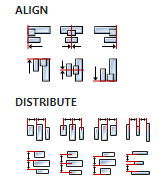
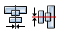

# PROPERTIES

## Geometry properties [EMPTY]

## Align and distribute

Alignment icons and component distribution. Alignment icons appear when two or more components are selected, and distribution icons appear when three or more components are selected.

## Center widget

Icons for horizontal and vertical centering of widgets within a page or parent widget.

## Inputs

Additional component inputs that the user can add as desired in order to use them to receive additional data needed when evaluating expressions in properties. Each input is given a name and type. Name is used when referencing an input within an expression. A type is used to project _Check_ to check whether a data line that transmits data of that type is connected to the input or not.

## Outputs

Additional component outputs that the user can add to send data through. Each output is assigned a name and type. An example of using this output is e.g. in the _Loop_ component, where we can put the output name for the `Variable` property instead of e.g. variable name. In that case, the _Loop_ component will not change the content of the variable in each step, but will send the current value through that output.

## Catch error

If this checkbox is enabled then an `@Error` output will be added to the component and if an error occurs in this component during the execution of the Flow, the Flow will continue through that output. The data that will be passed through that output is the textual description of the error.
