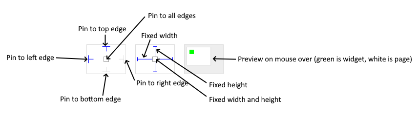

# PROPERTIES

## Resizing

If the page where this Widget is located has the "Scale to fit" option enabled, then this option can be used to control how the position and size of the widget will be calculated when scaling the page:

With the _Pin to edge_ option we can fix the top, right, bottom and left edge of the Widget in relation to the page when it changes its original dimension because the _Scale to fit_ option is selected. E.g. if we selected _Pin to top edge_ then the distance between the top edge of the page and the top edge of the Widget will always be the same, in other words the Top position does not change the value. If _Pin to top edge_ is not selected, then the Top position will scale proportionally as the page height scales.

Using the _Fix size_ option, we can fix the width/height of the Widget, i.e. if this option is selected the width/height will always be the same, and if not selected the width/height will scale proportionally as the page height scales.

Note: If _Pin to left edge_ and _Pin to right edge_ are selected, then the _Fix width_ option will be disabled, and conversely if _Fix width_ is selected, then both _Pin to left edge_ and _Pin to right edge_ cannot be selected, because both cannot be satisfied. The same applies to _Pin to top edge_ and _Pin to bottom edge_ and _Fix width_.

## Visible

If the calculated expression is true then the Widget is visible, and if it is false then the Widget is hidden. It can be left blank, in which case the Widget is always visible.

## Style ui [EMPTY]

## Hide "Widget is outside of its parent" warning

Check when we want to hide "Widget is outside of its parent" warning message(s).

## Locked [EMPTY]

## Hidden in editor [EMPTY]

## Timeline [EMPTY]

## Keyframe editor [EMPTY]

## Tab title

If this widget is a child of a container with layout set to `Docking Manager`, use this property to set the title of the tab that contains this widget.

## Event handlers

List of event handler definitions. During execution, the widget can generate certain events (e.g. the `CLICKED` event is generated when the touchscreen is pressed and released within the Widget) and through this list we can specify the method of event processing. We must define these properties for each event handler:

-   `Event` – Event that is processed, e.g. `CLICKED`.
-   `Handler type` – There are two options: `Flow` or `Action`. If `Flow` is selected, a flow output will be added through which the event is processed, and if `Action` is selected, then it is necessary to specify which User action will be performed during event processing.
-   `Action` - If the `Handler type` is set to `Action`, then here we need to enter the name of the User action that will be performed during the processing of the selected event.

## Output widget handle

If enabled then a new output named `@Widget` will be added. In runtime, upon a widget creation, a value of type `widget` will be sent through this output. This value can be used in other parts of the flow when reference to the widget is required. One such example is `AddToInstrumentHistory` action component when `Plotly` is selected for the `Item type` property. Then it is necessary to set the property `Plotly widget` to the reference to LineChart widget.
