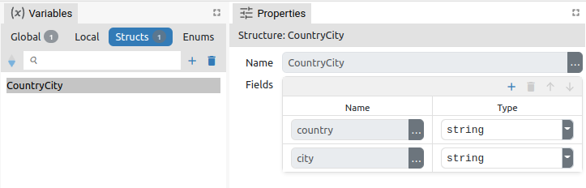

# DESCRIPTION [DRAFT]

Parses a CSV string, constructs a value of the set type and sends it through the `result` output.

# PROPERTIES

## Input [DRAFT]

CSV string to be parsed.

## Delimiter [DRAFT]

Defines the character used to delimitate the fields inside a CSV record. Default is `","`.

## From [DRAFT]

The from option handles records starting from a requested number of records. Count is 1-based, for example, provides 1 (and not 0) to emit first record.

## To [DRAFT]

The to option handles records until a requested number of records. Count is 1-based, for example, provides 1 (and not 0) to emit first record.

# INPUTS

## seqin [DRAFT]

A standard sequence input.

## text [DRAFT]

The input through which the CSV string to be parsed is received. This input can be deleted (we delete it in the Flow - Inputs list) if it is not needed, i.e. if we want to parse a string obtained by evaluating an arbitrary expression set through `Input` property.

# OUTPUTS

## seqout [DRAFT]

A standard sequence output.

## result [DRAFT]

Data output to which the constructed value is sent. The type of that value must be specified - this should be done in the Flow - Outputs section:


In the _CSV_ example mentioned below, we have a CSV string that looks like this:

```
[
    {
        "country": "Afghanistan",
        "city": "Kabul"
    },
    {
        "country": "Albania",
        "city": "Tirana"
    },
    {
        "country": "Algeria",
        "city": "Alger"
    },
    ...
]
```

The constructed value returned by this Action should be of type `array:CountryCity`, where `CountryCity` is a structure that has two fields (the name of the structure `CountryCity` is arbitrarily chosen by the developer):

-   `country`, whose type is `string`
-   `city`, whose type is `string`

The definition of that structure looks like this in the Project editor:



# EXAMPLES [DRAFT]

-   CSV
