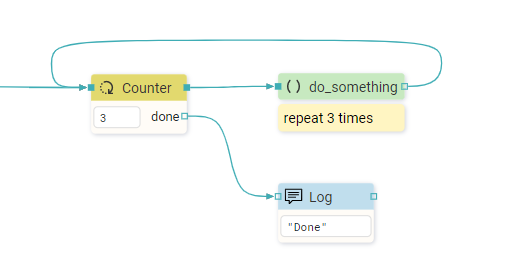

# DESCRIPTION

Used to execute a specific part of the Flow a given number of times.

# PROPERTIES

## Count value

Expression that defines the number of repetitions in the loop.

# INPUTS

## seqin

A standard sequence input.

# OUTPUTS

## seqout

Flow execution continues through this output until the given number of repetitions has been completed.

## done

Flow execution continues through this output when the given number of repetitions has been completed.

# EXAMPLES [EMPTY]
