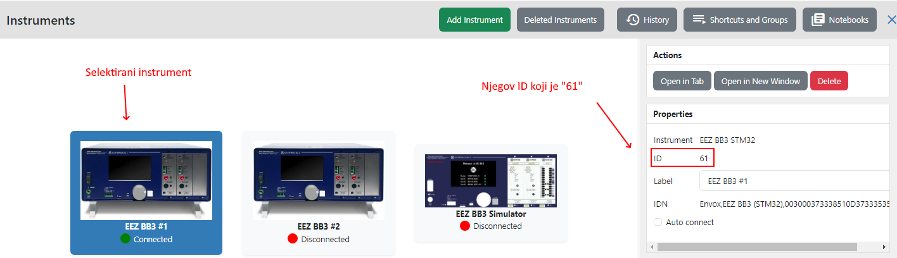
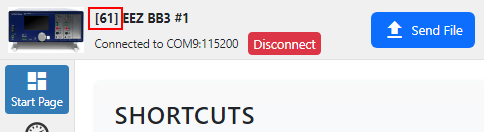

# DESCRIPTION

Retrieves an instrument object by its ID. The instrument ID can be found in these two places: Instrument `Properties` when the instrument is selected on the `Instruments` Home page and in the header of the `Terminal` tab of the instrument.

Use this Action when you want to access a specific instrument, i.e. you don't want to use a dialog box as a method for selecting an instrument.

# PROPERTIES

## Instrument ID

The ID of the instrument whose object we want to retrieve.

# INPUTS

## seqin

A standard sequence input.

# OUTPUTS

## seqout

A standard sequence output

## instrument

The retrieved object is sent to this output.

# EXAMPLES [EMPTY]
