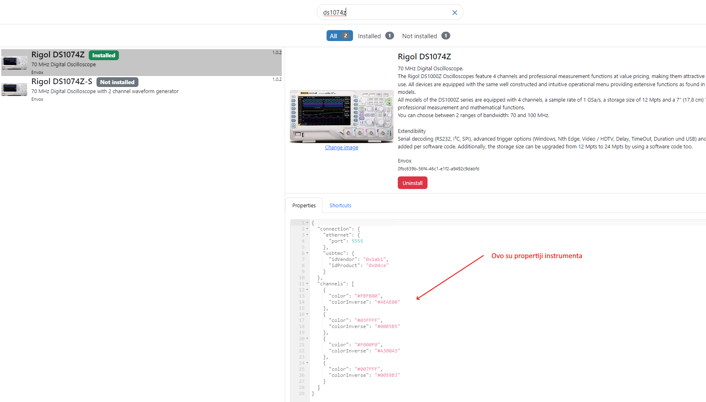
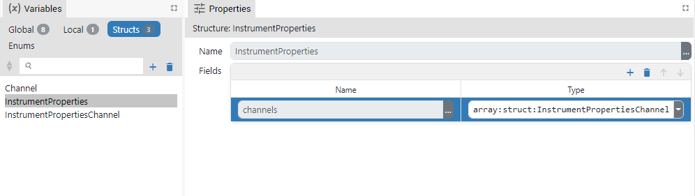
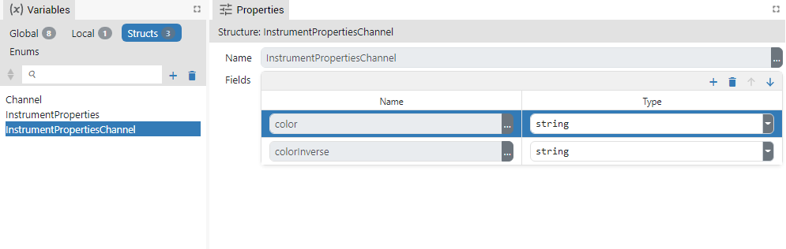
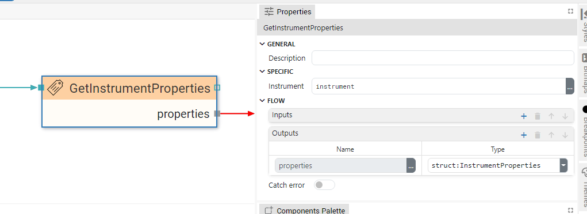

# DESCRIPTION

Using this Action, we can retrieve the instrument properties that are defined within the IEXT instrument extension.

For example, in the `Rigol Waveform Data` example, we want to retrieve how many channels the instrument has and what color is used for each channel. First, we can look at all the properties of the Rigol DS1000Z instrument:

Now it is necessary to define the Flow variable type in which we want to store the properties we are interested in. In this case, we define the type `struct:InstrumentProperties` defined as follows:

The `InstrumentProperties` structure has one member called `channels`, which is of type `array:InstrumentPropertiesChannel`, and which is defined as follows:

And now using this Action in one step we can retrieve information about all channels:

After we have retrieved the properties, we can find out the number of channels with `Array.length(properties.channels)`, and the color, for example, of the 1st channel with: `properties.channels[0].color`.

# PROPERTIES

## Instrument

The instrument whose properties will be retrieved.

# INPUTS

## seqin

A standard sequence input.

# OUTPUTS

## seqout

A standard sequence output.

## properties

Retrieved properties are sent to this output.

# EXAMPLES

- _Rigol Waveform Data_
