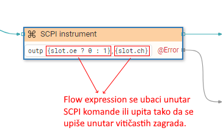
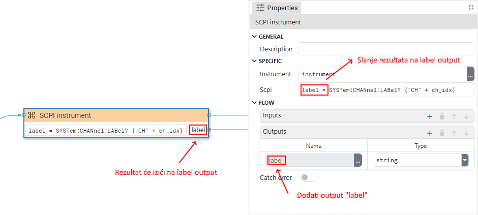
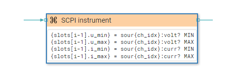

# DESCRIPTION

Executes one or more SCPI commands or queries on the selected instrument. When all commands/queries are executed Flow execution continues through `seqout` output.

# PROPERTIES

## Instrument

Instrument object on which commands/queries are executed. This property is only present within the _Dashboard_ project when the instrument is connected remotely, i.e. it is possible to have open connections to several instruments at the same time. If it is an _EEZ-GUI_ project, then this property does not exist because we always use the device on which Flow is executed and we send SCPI commands to it.

## Scpi

List of SCPI commands/queries. Each command/query must be entered as a separate line. A Flow expression can also be inserted inside the command/query, which must be entered between two curly brackets. This is an example taken from the _BB3 Dashboard_ example that uses a Flow expression within an SCPI command:

Also in the example above, a Flow `Catch Error` has been added to catch an error during the execution of the SCPI component.

For an SCPI query, it must be specified where the result is sent, and there we have two options:

-   Sending results to Flow output. It is necessary to add a new output using the "Flow - Outputs" section in the properties of this component, where it is necessary to write: `output_name=query?`. Here's an example, taken from the _BB3 Dashboard_ example:

-   Saving the result in a variable. The results are saved in a variable so that the query is written like this: `variable_name=query?` or `{assignable_expression}=query?`.
    This second form is used when it is stored, for example, in a structure member or an array. Here are examples for both forms, also taken from the _BB3 Dashboard_ example:

    -   In this example, the result of the `SYSTem:CPU:FIRMware?` query is saved in the `fw_ver` variable. As it is the first (simple) form, then the name of the variable should not be enclosed in curly brackets.

        

    -   In this example, four SCPI queries are executed. The results are saved in the slots variable of the type: `array:struct:Slot`, where slots is a structure that has `u_min`, `u_max`, `i_min` and `i_max` members. The second form is used here and the assignable expression must be enclosed in curly brackets. Also here we have an example of using the expression `{ch_idx}` within the query itself.

        

## Timeout (ms)

The time in milliseconds to wait for the result of the query. If the result does not expire within that time, a Timeout error is generated, which can be handled through `@Error` output if `Catch error` is enabled. If set to `null' then the timeout as specified in the Instrument _Connect_ dialog is used.

## Delay (ms)

The minimum time specified in milliseconds that must elapse before a new SCPI command or query is sent. If set to `null' then the delay as specified in the Instrument _Connect_ dialog is used.

# INPUTS

## seqin

A standard sequence input.

# OUTPUTS

## seqout

A standard sequence output.

# EXAMPLES

-   _BB3 Dashboard_
-   _Plotly_
-   _Rigol Waveform Data_
-   _Screen Capture_
