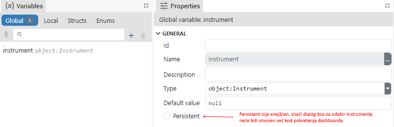

# DESCRIPTION

Opens a dialog box for selecting an instrument. The selected instrument is sent to the `instrument` output.

It will not be necessary to use this Action if the global instrument object variable is set to `Persistent`, because the instrument selection dialog box will open immediately when the dashboard is started.
However, if we don't want the instrument selection dialog box to open automatically at startup, then we must not enable the `Persistent` checkbox for the global instrument variable and we can use this Action later to select the desired instrument.

# PROPERTIES

# INPUTS

## seqin

A standard sequence input.

# OUTPUTS

## seqout

A standard sequence output.

## instrument

The selected instrument is sent to this output.

# EXAMPLES [EMPTY]
