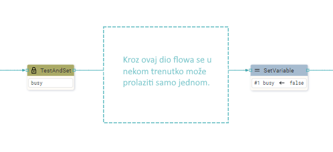

# DESCRIPTION

It tests the `boolean` variable and if it is `false` then it is set to `true` and output to the sequential output (`seqout`), and if it is `true` then it is put back into the Flow execution queue, i.e. this action waits until the variable becomes `false`.  
This testing and setup is done **as a single atomic (non-interruptable) operation**, so this Action is suitable for the case when you want to make sure that at some point you only go through a certain part of the Flow once. In that case, this Action should be set before entering that part of the Flow, and at the exit from the Flow, the variable should be set to `false` again with the _SetVariable_ Action.

# PROPERTIES

## Variable

The variable to be tested and set.

# INPUTS

## seqin

A standard sequential input.

# OUTPUTS

## seqout

Flow execution continues through this sequential output when the variable becomes `false`.

# EXAMPLES

- _Tetris_

    In the `do_action` User action, which is called when it is detected that some key on the keyboard is pressed, the TestAndSet action on the `busy` variable is used at the beginning, and before the exit the `busy` variable is set to `false`.
    In this way, it is ensured that two Actions are not executed simultaneously.
