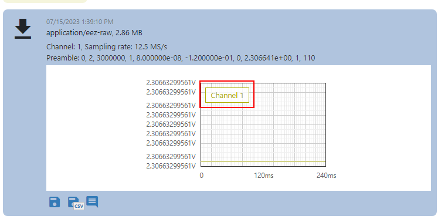

# DESCRIPTION

Displays a line chart using the same Widget as in the Instrument _History_ panel.

# PROPERTIES

## Data [EMPTY]

## Default style

Style used when rendering of the Widget.

## Chart mode

The following modes are available:

- `Single chart` – Displays a single chart.
- `Multiple charts` – Displays multiple charts.
- `EEZ DLOG` – Displays the chart given by the EEZ DLOG file format.
- `Instrument History Item` – Displays a chart from the instrument history.

## Chart data

If `Chart mode` is set to `Single chart`, then a string, array or blob containing the samples that will be displayed in the chart should be set here. If `Chart mode` is set to `EEZ DLOG` then the content of the EEZ DLOG file should be set here (e.g. it can be read with `FileRead` Action, see _EEZ Chart_ example).

This property is not used when the `Chart mode` is `Multiple charts` or `Instrument History item`.

## Format

Format of `Data` property. Possible values:

- `"float"` – "Chart data" must be a blob containing 32-bit, little-endian float numbers, or `array:float`
- `"double"` – "Chart data" must be a blob containing 64-bit, little-endian float numbers, or `array:float`
- `"rigol-byte"` – "Chart data" must be a blob containing 8-bit unsigned integer numbers
- `"rigol-word"` – "Chart data" must be a blob containing 16-bit unsigned integer numbers
- `"csv"` – "Chart data" must be a CSV string, the first column is taken

This property is only used when the `Chart mode` is `Single chart`.

## Sampling rate

Sampling rate or number of samples per second (SPS).

This property is only used when the `Chart mode` is `Single chart`.

## Unit name

The unit displayed on the Y-axis. The X-axis is always time.

This property is only used when the `Chart mode` is `Single chart`.

## Color

The color of the line in the chart.

This property is only used when the `Chart mode` is `Single chart`.

## Label

Chart label:

This property is only used when the `Chart mode` is `Single chart`.

## Offset

Offset value used in formula `offset + sample_value * scale` which transforms sample value to sample position on y axis in the chart.

This property is only used when the `Chart mode` is `Single chart`.

## Scale

When displaying samples, the formula `offset + sample_value * scale` is used.

This property is only used when the `Chart mode` is `Single chart`.

## Charts

List of chart definitions when `Chart mode` is set to `Multiple charts`. Each definition contains these properties:

- `Chart data`
- `Format`
- `Sampling rate`
- `Unit`
- `Color`
- `Label`
- `Offset`
- `Scale`

These properties have the same meaning as the corresponding property when `Single chart` mode is selected.

## History item ID

This ID is obtained using `AddToInstrumentHistory` action through `id` output of that action.

This property is only used when the `Chart mode` is `Instrument History Item`.

# INPUTS [EMPTY]

# OUTPUTS [EMPTY]

# EXAMPLES

* _Line Chart_
* _EEZ Chart_
* _Rigol Waveform Data_
