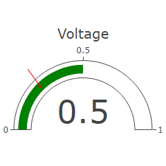

# DESCRIPTION

Displays the value selected through the `Data` property inside the gauge chart.

# PROPERTIES

## Data

The value within the `[Min, Max]` range that is displayed in the Widget.

## Default style

Style used when rendering the background of the Widget.

## Title

The name displayed above the gauge chart.

## Min range

The minimum value that `Data` can contain.

## Max range

The maximum value that `Data` can contain.

## Color

The color of the arc bar inside the chart.

## Margin

Manually selected margin values between the Widget borders and the chart itself within the Widget.

# INPUTS [EMPTY]

# OUTPUTS [EMPTY]

# EXAMPLES

* _Dashboard Widgets Demo_
