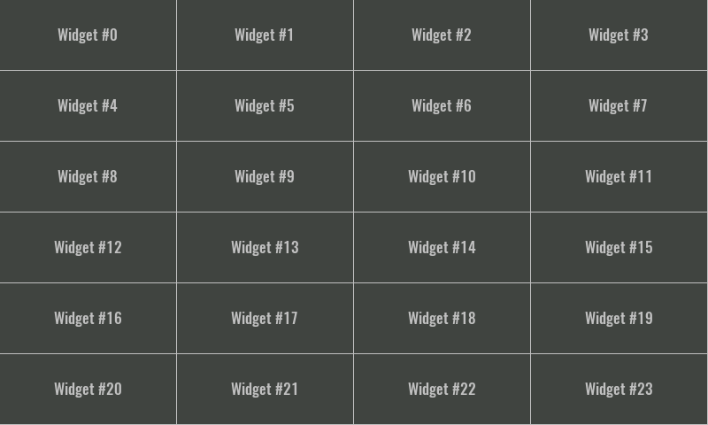
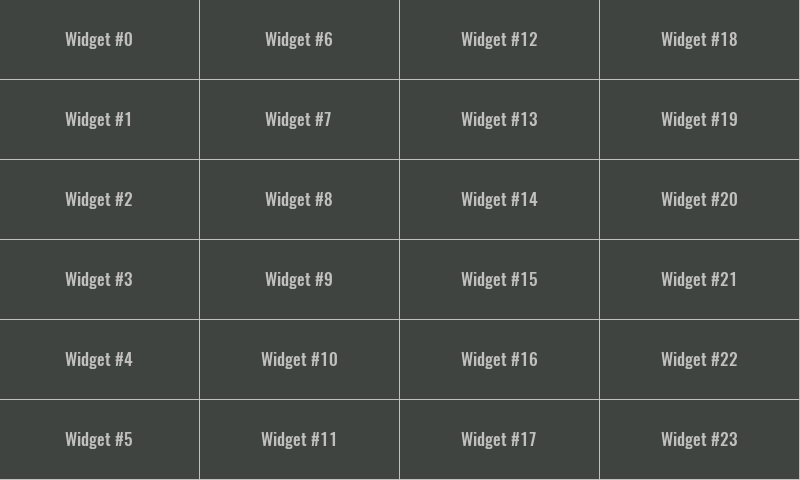

# DESCRIPTION

Use this Widget when you want to display the same Widget multiple times inside the grid. This Widget has one Child widget under it, and the number of times it will be displayed depends on the `Data` property.

Multiplied Widgets depending on the `Grid flow` property can be displayed by filling the rows first:

... or columns:

It wouldn't be very useful if multiplied Widgets always had the same content, that's why there is a system variable `$index` that tells us in which order the Widget is rendered. That variable is zero based, that means when its value is 0 then the first Widget is rendered, when its value is 1 then the second Widget is rendered and so on. That `$index` can then be used within the expression of the property of the Child widget, and in this way it is achieved that each rendered Widget has different content (e.g. the contents shown above were created in such a way that we defined for the `Text` widget that the displayed text is calculated from the following expression: `"Widget #" + $index`).

# PROPERTIES

## Data

Determines how many times the Child widget will be multiplied, i.e. the number of elements in the grid. The value of this property can be an integer and then it is the number of elements, and if the value of this property is an array, then the number of elements in the list is equal to the number of elements in that array.

In the case of _EEZ-GUI_ projects, the value of this property can also be `struct:$ScrollbarState`. The same structure is used for the `ScrollBar` Widget, which can then be connected to the `Grid` Widget via the `struct:$ScrollbarState` variable and thus enable scrolling of the list in case the total number of list elements is greater than the number of elements that fit within the `Grid` Widget.

More about the `struct:$ScrollbarState` system structure can be found in the `ScrollBar` Widget documentation.

## Default style

Style used when rendering the background of the Widget.

## Item widget [EMPTY]

## Grid flow

Defines the grid filling method. We need to select `Row` if we want it to be filled row by row. We will select `Column` if we want it to be filled column by column.

# INPUTS [EMPTY]

# OUTPUTS [EMPTY]

# EXAMPLES

-   _eez-gui-widgets-demo_
-   _Tetris_
