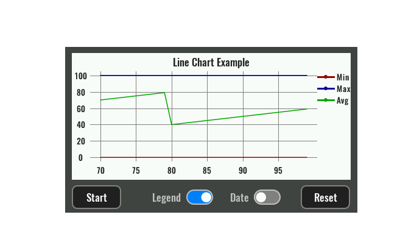

# DESCRIPTION [DRAFT]

Prikazuje Line chart koji se sastoji od ovih dijelova:

-   Title
-   X Axis
-   Y axis
-   Legend
-   Grid
-   One or more lines

Na početku chart nema niti jednu točku na linijama. Kako bi smo dodali točku potrebno je proslijediti podatak kroz `value` input. Za svaki primjeljeni podatak na tom inputu dodaje se po jedna točka. Iz primljenog podatka se onda treba izračunati X i Y vrijednosti te točke na svim linija. Npr. primljeni podatak može biti strukutra koja u sebi ima X vrijednost i Y vrijednost za svaku liniju.

# PROPERTIES

## Data [EMPTY]

## Default style [DRAFT]

Style koji se koristi za renderiranje pozadine widgeta.

## X value [DRAFT]

Definira vrijednost na X osi za dodanu točku. Može se postaviti na trenutno vrijeme sa `Date.now()` ili neku drugu vrijednost, ali se mora paziti da vrijednost raste sa svakom novododanom toćkom.

## Lines [DRAFT]

Definira jednu ili više linija na Y osi. Za svaku liniju se zadaje:

-   Label - Naziv linije koji se prikazuje u Legend.
-   Color - Boja linije.
-   Line width - Debljina linije u pikselima.
-   Value - Vrijednost na Y osi za dodanu točku.

## Show title [DRAFT]

Postaviti na checked ako se želi renderirati title.

## Show legend [DRAFT]

Postaviti na checked ako se želi renderirati legend.

## Show X axis [DRAFT]

Postaviti na checked ako se želi renderirati X axis.

## Show Y axis [DRAFT]

Postaviti na checked ako se želi renderirati Y axis.

## Show grid [DRAFT]

Postaviti na checked ako se želi renderirati grid.

## Title [DRAFT]

Naziv charta.

## Y axis range option [DRAFT]

Ovdje imamo dvije opcije:

-   `Floating`: Y axis range će biti automatski odabran na osnovu Y vrijednosti u svim točkama.
-   `Fixed`: Y axis range je zadan preko `Y axis range from` i `Y axis range to` propertija.

## Y axis range from [DRAFT]

Ako je za `Y axis range option` odabrano `Fixed` onda se s ovim propertijem zadaje donja granica raspona Y osi.

## Y axis range to [DRAFT]

Ako je za `Y axis range option` odabrano `Fixed` onda se s ovim propertijem zadaje gornja granica raspona Y osi.

## Max points [DRAFT]

Maksimalni broj točaka koji se prikazuju.

## Margin [DRAFT]

Ručno odabrane vrijednosti margina između granica widgeta i samog charta unutar widgeta. Potrebno je ostaviti prazan prostor za Title (prikazuje se iznad charta pa treba odabrati odgovarajući Top margin), X axis (prikazuje se ispod charta, Bottom margin), Y axis (prikazuje se lijevo od charta, Left margin) i Legend (prikazuje se desno od charta, Right margin).

## Marker [DRAFT]

Na ovoj poziciji biti će prikazana vertikalna linija unutar charta koristeću stil `Marker style`.

## Title style [DRAFT]

Style koji se koristi za renderiranje title.

## Legend style [DRAFT]

Style koji se koristi za renderiranje legende.

## X axis style [DRAFT]

Style koji se koristi za renderiranje x axis.

## Y axis style [DRAFT]

Style koji se koristi za renderiranje y axis.

## Marker style [DRAFT]

Style koji se koristi za renderiranje markera.

# INPUTS

## reset [DRAFT]

Pošaljite signal kroz ovaj input ako želite pobrisati sve točke na chartu.

## value [DRAFT]

Pošaljite vrijednost kroz ovaj input ako želite dodati točku unutar charta. Kada se dosegne maksimalni broj točaka, koji je zadan kroz `Max points` property, onda će se obrisati najstarija dodana točka.

# OUTPUTS [EMPTY]

# EXAMPLES [DRAFT]

-   Line Chart
