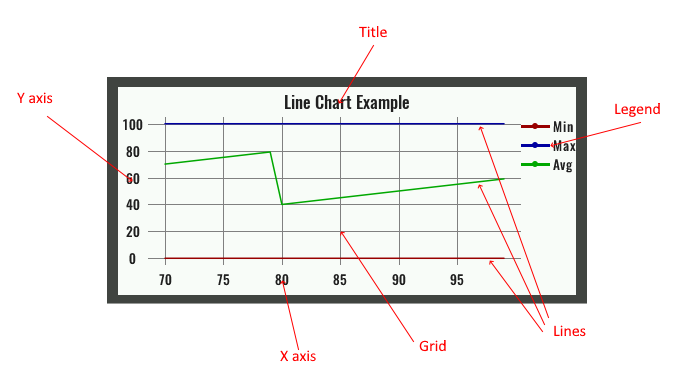

# DESCRIPTION

Displays a Line chart consisting of the following parts:

- Title
- X Axis
- Y axis
- A legend
- Grid
- One or more lines

At the beginning of the chart there is not a single point on the lines. In order to add a point, it is necessary to pass the data through `value` input. One point is added for each applied data on that input. The X and Y values of that point on all lines should then be calculated from the received data. For example the received data can be a structure that has an X value and a Y value for each line.

# PROPERTIES

## Data [EMPTY]

## Default style

Style used when rendering of the Widget.

## X value

Defines the value on the X-axis for the added point. It can be set to the current time with `Date.now()` or some other value, but care must be taken to increase the value with each newly added point.

## Lines

Defines one or more lines on the Y-axis. The following must be specified for each line:

- `Label` – The name of the line that is displayed in the Legend.
- `Color` – Color of the line.
- `Line width` – The thickness of the line in pixels.
- `Value` – The value on the Y axis for the added point.

## Show title

It should be set if we want to render the title.

## Show legend

It should be set if we want to render the legend.

## Show X axis

It should be set if we want to render the X-axis.

## Show Y axis

It should be set if we want to render the Y-axis.

## Show grid

It should be set if we want to render the grid.

## Title

Name of the chart.

## Y axis range option

Here we have two options:

- `Floating` – Y-axis range will be automatically selected based on the Y value at all points.
- `Fixed` – Y-axis range is set via `Y axis range from` and `Y axis range to` items.

## Y axis range from

If `Fixed` is selected for `Y axis range option`, then the lower limit of the Y-axis range is set with this item.

## Y axis range to

If `Fixed` is selected for `Y axis range option`, then the upper limit of the Y-axis range is set with this item.

## Max points

The maximum number of points that will be displayed.

## Margin

Manually selected margin values between the Widget borders and the chart itself within the Widget. It is necessary to leave an empty space for Title (displayed above the chart, so the appropriate `Top` margin should be selected), X-axis (displayed below the chart, `Bottom` margin), Y-axis (displayed to the left of the chart, `Left` margin) and Legend (displayed to the right of the chart, `Right` margin).

## Marker

At this position, a vertical line will be displayed inside the chart using `Marker` style.

## Title style

Style used to render the title.

## Legend style

Style used to render the legend.

## X axis style

Style used to render the X-axis.

## Y axis style

Style used to render the Y-axis.

## Marker style

Style used to render the marker.

# INPUTS

## reset

If we want to erase all the points on the chart, it is necessary to send a signal to this input.

## value

The input to which the value of the point that we want to add to the chart is sent. When the maximum number of points, which is set through the `Max points` item, is reached, then the oldest added point will be deleted.

# OUTPUTS [EMPTY]

# EXAMPLES

* _Line Chart_
