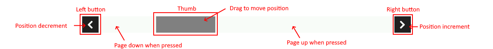

# DESCRIPTION

This Widget can be used with `List` and `Grid` Widget for scrolling within large lists that do not fit entirely within said Widgets. If `width` > `height` then a horizontal `ScrollBar` is displayed:

... and if `width` <= `height` then a vertical `ScrollBar` is displayed.

The horizontal `ScrollBar` has left and right buttons, and the vertical top and bottom buttons.

This Widget connects to the `List` or `Grid` Widget via a variable of type `struct:$ScrollbarState` which is set in the `Data` property. The structure `struct:$ScrollbarState` has these fields:

- `numItems` – how many items/elements are in the list
- `itemsPerPage` – how many items fit inside the `List` or `Grid` Widget.
- `positionIncrement` – determines how many items we will move within the list when the left/top button (shift to the left/up) or the right/bottom button (shift to the right/down) is selected.
- `position` – the position of the first item/element that is rendered in the list. So within the `List` or `Grid` Widget, items from `position` to `position + itemsPerPage` will be rendered. `position` can be in the interval from `0` to `numItems – itemsPerPage`.

The scrollbar can change its `position' in the following ways:

- By selecting the Left/Top button `position` is decreased by the `positionIncrement` value.
- By selecting Right/Bottom button `position` is increased by `positionIncrement` value.
- By moving the thumb `position` is set to a value in the interval from `0` to `numItems - itemsPerPage`.
- If the region between the Left/Top button and the thumb is selected, then the position is reduced by `itemsPerPage` (AKA "page up").
- If the region between the thumb and the Right/Bottom button is selected, then the position is increased by `itemsPerPage` (AKA "page down").

# PROPERTIES

## Data

Set here the name of the `struct:$ScrollbarState` type variable.

## Default style

Style used when rendering the background of the Widget.

## Thumb style

Style that will be used to render the scrollbar thumb.

## Buttons style

Style used to render the left and right buttons.

## Left button text

The text that will be displayed inside the left/top button. Usually a single character from an icons font is used.

## Right button text

The text that will be displayed inside the right/bottom button. Usually a single character from an icons font is used.

# INPUTS [EMPTY]

# OUTPUTS [EMPTY]

# EXAMPLES

* _eez-gui-widgets-demo_
