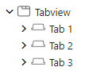

# DESCRIPTION

The Tab view object can be used to organize content in tabs. Tabview can be configured in two ways:

-   Place Tab widgets immediatelly under TabView:

    

-   Add two container widgets under Tabview. First container is for the tab Bar, second container is for the tab Content. In this configuration, Tab widgets should be placed under second container, Content. Use this configuration if you want to stye tab Bar and Content.

    

To add Tab widget to Tabview, drag and drop directly from the Widgets Palette to the Tabview inside Widgets Structure panel.

[More info](https://docs.lvgl.io/master/widgets/tabview.html)

# PROPERTIES

## Position

With this property, the tab bar can be moved to any sides.

## Size

The size of the tab bar. In case of vertical arrangement is means the height of the tab bar, and in horizontal arrangement it means the width.

# INPUTS [EMPTY]

# OUTPUTS [EMPTY]

# EXAMPLES

-   _Tabview_
-   _Styled Tabview_
